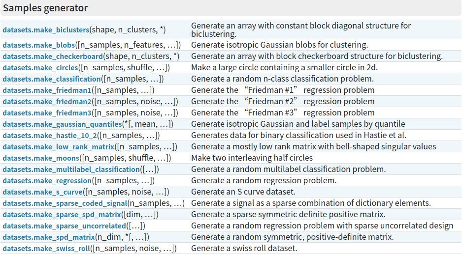

# 1.导论

关于什么是机器学习，有监督学习、无监督学习、回归、分类的解释，参考众多，不再赘述。

参考1：[DataWhale教程链接](https://github.com/datawhalechina/team-learning-data-mining/tree/master/EnsembleLearning)

参考2：DataWhale好文，[机器学习的通俗讲解！](https://mp.weixin.qq.com/s/WiAlhSRT-02SryeMM5ecpA)   也有非常棒的讲解。

下面进入Coding部分，首先，我们对数据的形式作出如下约定：      
第i个样本：$x_i=(x_{i1},x_{i2},...,x_{ip},y_i)^T,i=1,2,...,N$     
因变量$y=(y_1,y_2,...,y_N)^T$        
第k个特征:$x^{(k)}=(x_{1k},x_{2k},...,x_{Nk})^T$     
特征矩阵$X=(x_1,x_2,...,x_N)^T$

在学习机器学习中，我们经常使用scikit-learn简称sklearn工具库来探索机器学习项目，下面我们开始使用sklearn来演示这几个具体的概念：


```python
# 引入相关科学计算包
import numpy as np
import pandas as pd
import matplotlib.pyplot as plt
%matplotlib inline 
plt.style.use("ggplot")      # 样式美化
import seaborn as sns

# 设置在jupyter中打印所有输出
from IPython.core.interactiveshell import InteractiveShell
InteractiveShell.ast_node_interactivity = "all"
```

## 1.1 有监督学习

### 1.1.1 回归

我们用sklearn内置数据集Boston房价数据集来看一下。
sklearn中所有内置数据集都封装在datasets对象内，返回的对象有：

   - data:特征X的矩阵(ndarray)
   - target:因变量的向量(ndarray)
   - feature_names:特征名称(ndarray)

返回的对象均为ndarray，需要自己把它转换为dataframe。

```python
from sklearn import datasets
boston = datasets.load_boston()     # 返回一个类似于字典的类
X = boston.data
y = boston.target
X.shape
y.shape
features = boston.feature_names
features
boston_data = pd.DataFrame(X,columns=features)
boston_data["Price"] = y
boston_data.head()
```


    (506, 13)
    (506,)
    array(['CRIM', 'ZN', 'INDUS', 'CHAS', 'NOX', 'RM', 'AGE', 'DIS', 'RAD',
           'TAX', 'PTRATIO', 'B', 'LSTAT'], dtype='<U7')

<table border="1" class="dataframe">
  <thead>
    <tr style="text-align: right;">
      <th></th>
      <th>CRIM</th>
      <th>ZN</th>
      <th>INDUS</th>
      <th>CHAS</th>
      <th>NOX</th>
      <th>RM</th>
      <th>AGE</th>
      <th>DIS</th>
      <th>RAD</th>
      <th>TAX</th>
      <th>PTRATIO</th>
      <th>B</th>
      <th>LSTAT</th>
      <th>Price</th>
    </tr>
  </thead>
  <tbody>
    <tr>
      <th>0</th>
      <td>0.00632</td>
      <td>18.0</td>
      <td>2.31</td>
      <td>0.0</td>
      <td>0.538</td>
      <td>6.575</td>
      <td>65.2</td>
      <td>4.0900</td>
      <td>1.0</td>
      <td>296.0</td>
      <td>15.3</td>
      <td>396.90</td>
      <td>4.98</td>
      <td>24.0</td>
    </tr>
    <tr>
      <th>1</th>
      <td>0.02731</td>
      <td>0.0</td>
      <td>7.07</td>
      <td>0.0</td>
      <td>0.469</td>
      <td>6.421</td>
      <td>78.9</td>
      <td>4.9671</td>
      <td>2.0</td>
      <td>242.0</td>
      <td>17.8</td>
      <td>396.90</td>
      <td>9.14</td>
      <td>21.6</td>
    </tr>
    <tr>
      <th>2</th>
      <td>0.02729</td>
      <td>0.0</td>
      <td>7.07</td>
      <td>0.0</td>
      <td>0.469</td>
      <td>7.185</td>
      <td>61.1</td>
      <td>4.9671</td>
      <td>2.0</td>
      <td>242.0</td>
      <td>17.8</td>
      <td>392.83</td>
      <td>4.03</td>
      <td>34.7</td>
    </tr>
    <tr>
      <th>3</th>
      <td>0.03237</td>
      <td>0.0</td>
      <td>2.18</td>
      <td>0.0</td>
      <td>0.458</td>
      <td>6.998</td>
      <td>45.8</td>
      <td>6.0622</td>
      <td>3.0</td>
      <td>222.0</td>
      <td>18.7</td>
      <td>394.63</td>
      <td>2.94</td>
      <td>33.4</td>
    </tr>
    <tr>
      <th>4</th>
      <td>0.06905</td>
      <td>0.0</td>
      <td>2.18</td>
      <td>0.0</td>
      <td>0.458</td>
      <td>7.147</td>
      <td>54.2</td>
      <td>6.0622</td>
      <td>3.0</td>
      <td>222.0</td>
      <td>18.7</td>
      <td>396.90</td>
      <td>5.33</td>
      <td>36.2</td>
    </tr>
  </tbody>
</table>

```python
sns.scatterplot(boston_data['NOX'],boston_data['Price'],color="r",alpha=0.6)# alpha 点的透明度，0透明度最高，1透明度最低。
plt.title("Price~NOX")
plt.show()
```


    

```python
sns.scatterplot(boston_data['RM'],boston_data['Price'],color="r",alpha=0.6)# alpha 点的透明度，0透明度最高，1透明度最低。
plt.title("Price~RM")
plt.show()
```


我们可以从图上比较轻松的看出，特征NOX呈弱负相关，RM呈强正相关。
数据给定任务所需要的因变量，因变量为波士顿房价，**Price是一个连续型变量**，所以**波士顿数据集为典型的回归模型数据集**。

各个特征的相关解释：
   - CRIM：各城镇的人均犯罪率
   - ZN：规划地段超过25,000平方英尺的住宅用地比例
   - INDUS：城镇非零售商业用地比例
   - CHAS：是否在查尔斯河边(=1是)
   - NOX：一氧化氮浓度(/千万分之一)
   - RM：每个住宅的平均房间数
   - AGE：1940年以前建造的自住房屋的比例
   - DIS：到波士顿五个就业中心的加权距离
   - RAD：放射状公路的可达性指数
   - TAX：全部价值的房产税率(每1万美元)
   - PTRATIO：按城镇分配的学生与教师比例
   - B：1000(Bk - 0.63)^2其中Bk是每个城镇的黑人比例
   - LSTAT：较低地位人口
   - Price：房价

### 1.1.2 分类

我们再来看一个典型的分类模型数据集——鸢尾花iris数据集。


```python
from sklearn import datasets
iris = datasets.load_iris()
X = iris.data
y = iris.target
X.shape
y.shape
features = iris.feature_names
features
iris_data = pd.DataFrame(X,columns=features)
iris_data['target'] = y
iris_data.head()
y[:5]
```


    (150, 4)
    (150,)
    ['sepal length (cm)',
     'sepal width (cm)',
     'petal length (cm)',
     'petal width (cm)']

<table border="1" class="dataframe">
  <thead>
    <tr style="text-align: right;">
      <th></th>
      <th>sepal length (cm)</th>
      <th>sepal width (cm)</th>
      <th>petal length (cm)</th>
      <th>petal width (cm)</th>
      <th>target</th>
    </tr>
  </thead>
  <tbody>
    <tr>
      <th>0</th>
      <td>5.1</td>
      <td>3.5</td>
      <td>1.4</td>
      <td>0.2</td>
      <td>0</td>
    </tr>
    <tr>
      <th>1</th>
      <td>4.9</td>
      <td>3.0</td>
      <td>1.4</td>
      <td>0.2</td>
      <td>0</td>
    </tr>
    <tr>
      <th>2</th>
      <td>4.7</td>
      <td>3.2</td>
      <td>1.3</td>
      <td>0.2</td>
      <td>0</td>
    </tr>
    <tr>
      <th>3</th>
      <td>4.6</td>
      <td>3.1</td>
      <td>1.5</td>
      <td>0.2</td>
      <td>0</td>
    </tr>
    <tr>
      <th>4</th>
      <td>5.0</td>
      <td>3.6</td>
      <td>1.4</td>
      <td>0.2</td>
      <td>0</td>
    </tr>
  </tbody>
</table>

    array([0, 0, 0, 0, 0])


```python
np.unique(y)
for index,c in enumerate(np.unique(y)):
    print(index,c)
```


    array([0, 1, 2])
    0 0
    1 1
    2 2

```python
# 可视化特征
marker = ['s','x','o']
for index,c in enumerate(np.unique(y)):
    plt.scatter(x=iris_data.loc[y==c,"sepal length (cm)"],y=iris_data.loc[y==c,"sepal width (cm)"],alpha=0.8,label=c,marker=marker[c])
plt.xlabel("sepal length (cm)")
plt.ylabel("sepal width (cm)")
plt.legend()
plt.show()
```


    


我们可以看到：每种不同的颜色和点的样式为一种类型的鸢尾花，数据集有三种不同类型的鸢尾花。因此因变量是一个类别变量，因此通过特征预测**鸢尾花**类别的问题是一个**分类问题**。

各个特征的相关解释：
   - sepal length (cm)：花萼长度(厘米)

   - sepal width (cm)：花萼宽度(厘米)

   - petal length (cm)：花瓣长度(厘米)

   - petal width (cm)：花瓣宽度(厘米)

     

### 附1：sklearn自带的数据集

| 数据集大小 | 数据集名称             | 方法                                                         | 适用算法   |
| ---------- | ---------------------- | ------------------------------------------------------------ | ---------- |
| 小数据集   | 波士顿房价数据集       | [`load_boston`](https://scikit-learn.org/stable/modules/generated/sklearn.datasets.load_boston.html#sklearn.datasets.load_boston)([return_X_y]) | 回归       |
| 小数据集   | 鸢尾花数据集           | [`load_iris`](https://scikit-learn.org/stable/modules/generated/sklearn.datasets.load_iris.html#sklearn.datasets.load_iris)([return_X_y]) | 分类       |
| 小数据集   | 糖尿病数据集           | [`load_diabetes`](https://scikit-learn.org/stable/modules/generated/sklearn.datasets.load_diabetes.html#sklearn.datasets.load_diabetes)([return_X_y]) | 回归       |
| 小数据集   | 手写数字数据集         | [`load_digits`](https://scikit-learn.org/stable/modules/generated/sklearn.datasets.load_digits.html#sklearn.datasets.load_digits)([n_class, return_X_y]) | 分类       |
| 小数据集   | 亚麻布数据集           | [`load_linnerud`](https://scikit-learn.org/stable/modules/generated/sklearn.datasets.load_linnerud.html#sklearn.datasets.load_linnerud)([return_X_y]) | 多项式回归 |
| 小数据集   | 红酒数据集             | [`load_wine`](https://scikit-learn.org/stable/modules/generated/sklearn.datasets.load_wine.html#sklearn.datasets.load_wine)([return_X_y]) | 分类       |
| 小数据集   | 乳腺癌数据集           | [`load_breast_cancer`](https://scikit-learn.org/stable/modules/generated/sklearn.datasets.load_breast_cancer.html#sklearn.datasets.load_breast_cancer)([return_X_y]) | 分类       |
| 大数据集   | olivetti脸部图像数据集 | [`fetch_olivetti_faces()`](https://scikit-learn.org/stable/modules/generated/sklearn.datasets.fetch_olivetti_faces.html#sklearn.datasets.fetch_olivetti_faces) | 降维       |
| 大数据集   | 新闻分类数据集         | [`fetch_20newsgroups()`](https://scikit-learn.org/stable/modules/generated/sklearn.datasets.fetch_20newsgroups.html#sklearn.datasets.fetch_20newsgroups) | 分类       |
| 大数据集   | 带标签的人脸数据集     | [`fetch_lfw_people()`](https://scikit-learn.org/stable/modules/generated/sklearn.datasets.fetch_lfw_people.html#sklearn.datasets.fetch_lfw_people) | 分类；降维 |
| 大数据集   | 路透社新闻语料数据集   | [`fetch_rcv1()`](https://scikit-learn.org/stable/modules/generated/sklearn.datasets.fetch_rcv1.html#sklearn.datasets.fetch_rcv1) | 分类       |


### 附2：利用sklearn.datasets.make_classification 生成分类算法数据  

```
sklearn.datasets.make_classification(n_samples=100, n_features=20, *, n_informative=2, n_redundant=2, n_repeated=0, n_classes=2, n_clusters_per_class=2, weights=None, flip_y=0.01, class_sep=1.0, hypercube=True, shift=0.0, scale=1.0, shuffle=True, random_state=None)
```

入参：

- n_features : 特征个数,= n_informative + n_redundant + n_repeated + (n_features-n_informative-n_redundant-n_repeated)个随机抽取的重复无用特征。
- n_informative：多信息特征的个数
- n_redundant：冗余信息，informative特征的随机线性组合
- n_repeated ：重复信息，随机提取n_informative和n_redundant 特征
- n_classes：分类类别
- clusters_per_class ：某一个类别是由几个cluster构成的

出参：

- X，[n_samples, n_features]形状的数组，代表产生的样本
- y，[n_samples]形状的数组，代表每个点的标签(类别)


```python
x, y = datasets.make_classification(n_samples=1000,n_features=2, n_redundant=0, n_informative=2,
                             n_clusters_per_class=2)
for index,c in enumerate(np.unique(y)):
    plt.scatter(x[y==c, 0], x[y==c, 1],s=7)
plt.show()
```


    


## 1.2 无监督学习

我们可以使用sklearn生成符合自身需求的数据集，下面我们用其中几个函数例子来生成无因变量的数据集：   
https://scikit-learn.org/stable/modules/classes.html?highlight=datasets#module-sklearn.datasets    


### 1.2.1 利用sklearn.datasets.make_blobs 生成聚类算法数据

```
sklearn.datasets.make_blobs(n_samples=100, n_features=2, *, centers=None, cluster_std=1.0, center_box=-10.0, 10.0, shuffle=True, random_state=None, return_centers=False)
```

入参：
- n_samples 样本数，表示产生多少个数据
- n_features 特征数，表示数据是几维
- centers 表示数据点中心，可以输入int数字，代表有多少个中心，也可以输入几个坐标（fixed center locations）
- cluster_std 表示分布的标准差

出参：
- X，[n_samples, n_features]形状的数组，代表产生的样本
- y，[n_samples]形状的数组，代表每个点的标签(类别)

```python
# 生成符合正态分布的聚类数据
from sklearn import datasets
x, y = datasets.make_blobs(n_samples=2000, n_features=2, centers=3)
for index,c in enumerate(np.unique(y)):
    plt.scatter(x[y==c, 0], x[y==c, 1],s=7)
plt.show()
```


### 1.2.2 利用sklearn.datasets.make_moons 生成聚类算法数据 （月牙形）

```
sklearn.datasets.make_moons(n_samples=100, *, shuffle=True, noise=None, random_state=None)
```

入参：

- n_samples 样本数，表示产生多少个数据
- noise 加在数据上的高斯噪声的标准差

```python
# 生成月牙型非凸集
from sklearn import datasets
x, y = datasets.make_moons(n_samples=2000, shuffle=True,
                  noise=0.05, random_state=None)
for index,c in enumerate(np.unique(y)):
    plt.scatter(x[y==c,0],x[y==c,1],s=7)
plt.show()
```


​   

### 1.2.3 利用sklearn.datasets.make_circles 生成聚类算法数据 （环形）

```
sklearn.datasets.make_circles(n_samples=100, *, shuffle=True, noise=None, random_state=None, factor=0.8)
```

入参：

- n_samples 样本数，表示产生多少个数据
- noise 加在数据上的高斯噪声的标准差
- factor 内外圆之间的比例因子，介于[0,1]

```python
from sklearn import datasets
x, y = datasets.make_circles(n_samples=2000, shuffle=True,
                  noise=0.05, random_state=None,factor=0.3)
for index,c in enumerate(np.unique(y)):
    plt.scatter(x[y==c,0],x[y==c,1],s=7)
plt.show()
```


[^我是脚注]: 
[^s bf ]: 