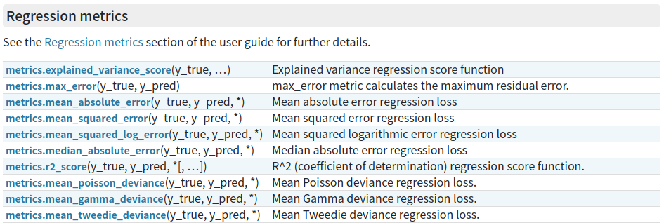
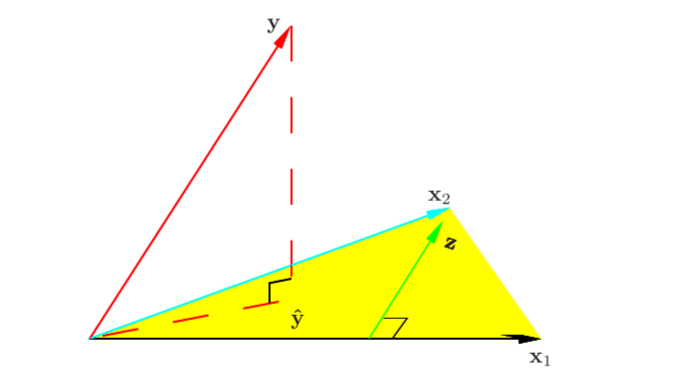
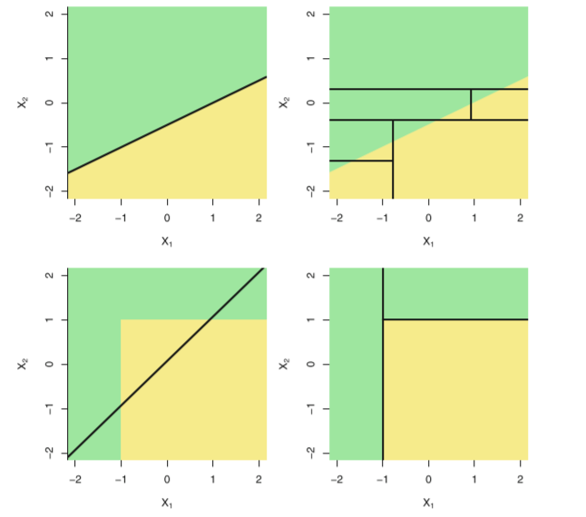

DataWhale教程：[DataWhale集成学习教程链接](https://github.com/datawhalechina/team-learning-data-mining/tree/master/EnsembleLearning)

写在前面：

2021.3.18  Task1还没啥大压力，到了Task2，对于从未推导过公式的我来说有些太吃力了，只能尽力做。本节课程除了SVR大部分原理都懂，实践问题都不大，调参还是个问题。手推公式暂时只能搞定最小二乘法，也算是进步。周末再回到Task2尝试一下，工作党伤不起。。

2021.3.20  昨晚看了萌老师，解了不少困惑，再更一版。
<br></br>
前面的Task：

[（一）集成学习上——机器学习三大任务](https://blog.csdn.net/youyoufengyuhan/article/details/114853640)

[TOC]

# 2. 使用sklearn构建完整的机器学习项目流程

一般来说，一个完整的机器学习项目分为以下步骤：
   1. 明确解决问题的模型类型：<font color=red>回归/分类</font>
   2. 收集数据集并选择合适的<font color=red>特征</font>。
   3. 选择度量模型性能的<font color=red>指标</font>。
   4. 选择具体的<font color=red>模型</font>并进行训练以优化模型。
   5. <font color=red>评估</font>模型的性能并调参。

## 2.1 使用sklearn构建完整的回归项目

   ### 2.1.1 明确解决问题的模型类型：<font color=red>回归/分类</font>
   本次实践项目为回归项目，回归的核心在于预测的结果是连续型变量。
   ### 2.1.2 收集数据集并选择合适的<font color=red>特征</font>
   数据集上我们使用上一节尝试过的Boston房价数据集。    


```python
import numpy as np
import pandas as pd
import matplotlib.pyplot as plt
%matplotlib inline 
plt.style.use("ggplot")      
import seaborn as sns
from sklearn import datasets
boston = datasets.load_boston()
X = boston.data
y = boston.target
features = boston.feature_names
boston_data = pd.DataFrame(X,columns=features)
boston_data["Price"] = y
boston_data.head()
```


<table border="1" class="dataframe">
  <thead>
    <tr style="text-align: right;">
      <th></th>
      <th>CRIM</th>
      <th>ZN</th>
      <th>INDUS</th>
      <th>CHAS</th>
      <th>NOX</th>
      <th>RM</th>
      <th>AGE</th>
      <th>DIS</th>
      <th>RAD</th>
      <th>TAX</th>
      <th>PTRATIO</th>
      <th>B</th>
      <th>LSTAT</th>
      <th>Price</th>
    </tr>
  </thead>
  <tbody>
    <tr>
      <th>0</th>
      <td>0.00632</td>
      <td>18.0</td>
      <td>2.31</td>
      <td>0.0</td>
      <td>0.538</td>
      <td>6.575</td>
      <td>65.2</td>
      <td>4.0900</td>
      <td>1.0</td>
      <td>296.0</td>
      <td>15.3</td>
      <td>396.90</td>
      <td>4.98</td>
      <td>24.0</td>
    </tr>
    <tr>
      <th>1</th>
      <td>0.02731</td>
      <td>0.0</td>
      <td>7.07</td>
      <td>0.0</td>
      <td>0.469</td>
      <td>6.421</td>
      <td>78.9</td>
      <td>4.9671</td>
      <td>2.0</td>
      <td>242.0</td>
      <td>17.8</td>
      <td>396.90</td>
      <td>9.14</td>
      <td>21.6</td>
    </tr>
    <tr>
      <th>2</th>
      <td>0.02729</td>
      <td>0.0</td>
      <td>7.07</td>
      <td>0.0</td>
      <td>0.469</td>
      <td>7.185</td>
      <td>61.1</td>
      <td>4.9671</td>
      <td>2.0</td>
      <td>242.0</td>
      <td>17.8</td>
      <td>392.83</td>
      <td>4.03</td>
      <td>34.7</td>
    </tr>
    <tr>
      <th>3</th>
      <td>0.03237</td>
      <td>0.0</td>
      <td>2.18</td>
      <td>0.0</td>
      <td>0.458</td>
      <td>6.998</td>
      <td>45.8</td>
      <td>6.0622</td>
      <td>3.0</td>
      <td>222.0</td>
      <td>18.7</td>
      <td>394.63</td>
      <td>2.94</td>
      <td>33.4</td>
    </tr>
    <tr>
      <th>4</th>
      <td>0.06905</td>
      <td>0.0</td>
      <td>2.18</td>
      <td>0.0</td>
      <td>0.458</td>
      <td>7.147</td>
      <td>54.2</td>
      <td>6.0622</td>
      <td>3.0</td>
      <td>222.0</td>
      <td>18.7</td>
      <td>396.90</td>
      <td>5.33</td>
      <td>36.2</td>
    </tr>
  </tbody>
</table>


各个特征的相关解释：
   - CRIM：各城镇的人均犯罪率
   - ZN：规划地段超过25,000平方英尺的住宅用地比例
   - INDUS：城镇非零售商业用地比例
   - CHAS：是否在查尔斯河边(=1是)
   - NOX：一氧化氮浓度(/千万分之一)
   - RM：每个住宅的平均房间数
   - AGE：1940年以前建造的自住房屋的比例
   - DIS：到波士顿五个就业中心的加权距离
   - RAD：放射状公路的可达性指数
   - TAX：全部价值的房产税率(每1万美元)
   - PTRATIO：按城镇分配的学生与教师比例
   - B：1000(Bk - 0.63)^2其中Bk是每个城镇的黑人比例
   - LSTAT：较低地位人口
   - Price：房价

  ### 2.1.3 选择度量模型性能的<font color=red>指标</font>
   - MSE均方误差： $\text{MSE}(y, \hat{y}) = \frac{1}{n_\text{samples}} \sum_{i=0}^{n_\text{samples} - 1} (y_i - \hat{y}_i)^2.$
   - MAE平均绝对误差:$\text{MAE}(y, \hat{y}) = \frac{1}{n_{\text{samples}}} \sum_{i=0}^{n_{\text{samples}}-1} \left| y_i - \hat{y}_i \right|$
   - $R^2$决定系数：$R^2(y, \hat{y}) = 1 - \frac{\sum_{i=1}^{n} (y_i - \hat{y}_i)^2}{\sum_{i=1}^{n} (y_i - \bar{y})^2}$
   - 解释方差得分:$explained\_{}variance(y, \hat{y}) = 1 - \frac{Var\{ y - \hat{y}\}}{Var\{y\}}$

[sklearn中的度量性能指标的方法](https://scikit-learn.org/stable/modules/model_evaluation.html#regression-metrics)：

 
在这个案例中，我们使用<font color=red>MSE均方误差</font>为模型的性能度量指标。


   ### 2.1.4 选择具体的<font color=red>模型</font>并进行训练以优化模型。

#### 1. 线性回归模型（[sklearn.linear_model.LinearRegression](https://scikit-learn.org/stable/modules/generated/sklearn.linear_model.LinearRegression.html#sklearn.linear_model.LinearRegression)）

回归分析是一种预测性的建模技术，它研究的是因变量（目标）和自变量（特征）之间的关系。这种技术通常用于预测分析，时间序列模型以及发现变量之间的因果关系。通常使用曲线/线来拟合数据点，目标是使曲线到数据点的距离差异最小。而线性回归就是回归问题中的一种，线性回归假设目标值与特征之间线性相关，即满足一个多元一次方程。通过构建损失函数，来求解损失函数最小时的参数$w$ ：                                                

假设：数据集$D = \{(x_1,y_1),...,(x_N,y_N) \}$，$x_i \in R^p,y_i \in R,i = 1,2,...,N$，$X = (x_1,x_2,...,x_N)^T,Y=(y_1,y_2,...,y_N)^T$

假设X和Y之间存在线性关系，模型的具体形式为$\hat{y}=f(w) =w^Tx$

那，这各个矩阵长什么样子呢？让我们来试试，在脑子里画出来。
$$
\begin{aligned}
&每个独立的向量，默认都是竖着的,列向量，也是 a\times1。\hspace{100cm}\\
&目前已知是有n个样本，我们假设有m个特征，那么：\\
& w: m\times 1 \\
\\
& x_i:m\times 1 \\
& (x_1,x_2,...,x_N): m\times n \\
& X = (x_1,x_2,...,x_N)^T: n\times m \\
\\
& y_i: 1\times 1\\
& (y_1,y_2,...,y_N):1\times n \\
& Y=(y_1,y_2,...,y_N)^T:n\times 1 \\
\\
& 对于单个样本
\hat{y_i}=f(w)_i =w_i^Tx_i: 1\times m \cdot m\times 1 =1\times 1 \\
& 对于所有样本
\hat{y}=f(w) =w^TX^T: 1\times m \cdot m\times n =1\times n ，与Y^T一致\\
\end{aligned}
$$

##### ① 原理

(1) 最小二乘法

损失函数的构建有多种方式，最小二乘法采用了L2，残差平方和（RSS）。现在问题转换成了求解让残差平方和最小化的参数向量 ，这种通过最小化真实值和预测值之间的RSS来求解参数的方法叫做最小二乘法。

**矩阵解法**：
$$
\begin{aligned}
残差平方和RSS:\\
L(w) & = \sum\limits_{i=1}^{N}||w^Tx_i-y_i||_2^2 \hspace{100cm} \\
& =\sum\limits_{i=1}^{N}(w^Tx_i-y_i)^2 \\
&【此处为计算残差平方和，利用上面我们在脑子里画的图，所有样本的残差为(w^TX^T-Y^T)\\
&,其向量为1\times n，残差平方和为1\times n \cdot n\times 1=1\times 1),即(w^TX^T-Y^T)(w^TX^T-Y^T)^T】\\
& = (w^TX^T-Y^T)(w^TX^T-Y^T)^T \\
& = (w^TX^T-Y^T)(Xw-Y) \\
& = w^TX^TXw - w^TX^TY-Y^TXW+YY^T \\
& 【w^TX^TY与Y^TXW互为转置,且均为1\times 1的矩阵，故可以合并】\\
& = w^TX^TXw - 2w^TX^TY+YY^T\\
 \end{aligned}
$$

$$
因此，我们需要找到使得L(w)最小时对应的参数w，即： \\
   \hat{w} = argmin\;L(w)\\ 
为了达到求解最小化L(w)问题，我们应用高等数学的知识，使用求导来解决这个问题： \\\frac{\partial L(w)}{\partial w} = 2X^TXw-2X^TY = 0,\\
【w^Tw=w^2是吗？？】\\
因此： X^TXw=X^TY\\
   \hat{w} = (X^TX)^{-1}X^TY \\
$$


**代数解法：**


在B站找了一个讲解视频，从代数的角度解题，https://www.bilibili.com/video/BV1q741177US?

损失函数为残差平方和：$\sum\limits_{i=1}^m(y_i-X_iw)^2=\sum\limits_{i=1}^{m}||y_i-X_iw||_2^2$， $y_i$为真实值，$X_iw$为预测值。

如下，$X_iw$为一阶方程，残差平方和为二阶方程，二阶方程的最优解在极值处，即导数为0的位置。求解极值的第一步往往是求解一阶导数并让一阶导数等于0，此时的$w$为我们想要求得的参数。

$X_iw = w0+w_1x_{i1}+w_2x_{i2}+w_3x_{i3}+w_nx_{in}$

对要求解的$w_i$依次作为要求解的参数，其他的作为常量，进行求导，使导数为0，则得到多个多元一次方程，求解即可。

(2) 几何解释

教程原文：

> 在线性代数中，我们知道两个向量a和b相互垂直可以得出：$<a,b> = a.b = a^Tb = 0$,而平面$X$的法向量为$Y-Xw$，与平面X互相垂直，因此：$X^T(Y-Xw) = 0$，即：$w = (X^TX)^{-1}X^TY$。

让我们来尝试解读这段话：

$x_1,x_2...,x_n$等多维特征线性组合构成平面$X$（下图仅展示出了$X_1$和$X_2$）,其预测值$Xw$为平面$X$上的任一向量（取决于$w$），预测值与真实值越接近，则向量之间的距离最小。真实值构成的向量$Y$与预测值向量$Xw$之间的最短距离，为真实值向量$Y$与平面$X$之间的最短距离，即平面$X$的法向量。

真实值向量$Y$与预测值向量$Xw$之间的距离为$(Y-Xw)$，当$(Y-Xw)$为平面$X$的法向量时，由$<a,b> = a.b = a^Tb = 0$ 可知，$(Y-Xw)$与平面$X$上的任意向量点积均为0。

取平面$X$上的任一向量$X$（$X$为特征的线性组合），则$X^T(Y-Xw) = 0$，可以解得$w = (X^TX)^{-1}X^TY$。

 

(3) 概率视角

假设噪声$\epsilon \backsim N(0,\sigma^2),y=f(w)+\epsilon=w^Tx+\epsilon$，因此：$y|x_i,w ~ N(w^Tx,\sigma^2)$  

我们使用极大似然估计MLE对参数$w$进行估计：       
$$
L(w) = log\;P(Y|X;w) = log\;\prod_{i=1}^N P(y_i|x_i;w) = \sum\limits_{i=1}^{N} log\; P(y_i|x_i;w)\\
    = \sum\limits_{i=1}^{N}log(\frac{1}{\sqrt{2\pi \sigma}}exp(-\frac{(y_i-w^Tx_i)^2}{2\sigma^2})) = \sum\limits_{i=1}^{N}[log(\frac{1}{\sqrt{2\pi}\sigma})-\frac{1}{2\sigma^2}(y_i-w^Tx_i)^2] \\
    argmax_w L(w) = argmin_w[l(w) = \sum\limits_{i = 1}^{N}(y_i-w^Tx_i)^2]\\
    因此：线性回归的最小二乘估计<==>噪声\epsilon\backsim N(0,\sigma^2)的极大似然估计
$$

（4）附录：极大似然估计

某件事情，已经发生了，估算在什么样的条件下，发生这件事情的概率最大。

##### ② 实践

（1）[sklearn中的线性回归](https://scikit-learn.org/stable/modules/generated/sklearn.linear_model.LinearRegression.html#sklearn.linear_model.LinearRegression) 

`class sklearn.linear_model.LinearRegression (fit_intercept=True, normalize=False, copy_X=True, n_jobs=None)`

该方法共有四个参数：

fit_intercept: 是否计算模型的截距，默认为True。

normalize:  标准化，默认为False。

copy_X： 是否在X.copy()上进行操作，默认为True。

 n_jobs：用于计算的作业数，默认为None/1。如果输入-1，则表示使用全部的CPU进行计算。

这些参数中并没有一个是必填的，更没有对我们的模型有不可替代作用的参数。这说明，线性回归的性能，往往取决于数据本身，而并非是我们的调参能力，线性回归也因此对数据有着很高的要求。


```python
from sklearn import linear_model      # 引入线性回归方法
lin_reg = linear_model.LinearRegression()       # 创建线性回归的类
lin_reg.fit(X,y)        # 输入特征X和因变量y进行训练
print("模型系数：",lin_reg.coef_)             # 输出模型的系数
print("模型截距：",lin_reg.intercept_)             # 输出模型的截距
print("模型得分：",lin_reg.score(X,y))    # 输出模型的决定系数R^2
```

    模型系数： [-1.08011358e-01  4.64204584e-02  2.05586264e-02  2.68673382e+00
     -1.77666112e+01  3.80986521e+00  6.92224640e-04 -1.47556685e+00
      3.06049479e-01 -1.23345939e-02 -9.52747232e-01  9.31168327e-03
     -5.24758378e-01]
    模型截距： 36.459488385089855
    模型得分： 0.7406426641094095


（2）[岭回归（原理待学习，解决多重共线性问题）](https://scikit-learn.org/stable/modules/generated/sklearn.linear_model.Ridge.html#sklearn.linear_model.Ridge)

`class sklearn.linear_model.Ridge (alpha=1.0, fit_intercept=True, normalize=False, copy_X=True, max_iter=None,
tol=0.001, solver=’auto’, random_state=None)`


```python
# 岭回归
from sklearn import linear_model      
ridge = linear_model.Ridge()      
ridge.fit(X,y)        
print("模型系数：",ridge.coef_)             
print("模型截距：",ridge.intercept_)            
print("模型得分：",ridge.score(X,y)) 
```

    模型系数： [-1.04595278e-01  4.74432243e-02 -8.80467889e-03  2.55239322e+00
     -1.07770146e+01  3.85400020e+00 -5.41453810e-03 -1.37265353e+00
      2.90141589e-01 -1.29116463e-02 -8.76074394e-01  9.67327945e-03
     -5.33343225e-01]
    模型截距： 31.597669818274195
    模型得分： 0.7388703133867616

（3）[Lasso回归（原理待学习，解决多重共线性问题）](https://scikit-learn.org/stable/modules/generated/sklearn.linear_model.Lasso.html#sklearn.linear_model.Lasso)

`class sklearn.linear_model.Lasso (alpha=1.0, fit_intercept=True, normalize=False, precompute=False,
copy_X=True, max_iter=1000, tol=0.0001, warm_start=False, positive=False, random_state=None, selection=’cyclic’)
ai`


```python
# Lasso回归
from sklearn import linear_model      
lasso = linear_model.Lasso()      
lasso.fit(X,y)        
print("模型系数：",lasso.coef_)             
print("模型截距：",lasso.intercept_)            
print("模型得分：",lasso.score(X,y)) 
```

    模型系数： [-0.06343729  0.04916467 -0.          0.         -0.          0.9498107
      0.02090951 -0.66879     0.26420643 -0.01521159 -0.72296636  0.00824703
     -0.76111454]
    模型截距： 41.05693374499338
    模型得分： 0.6825842212709925


#### 2. 线性回归的推广

在线性回归中，我们假设因变量与特征之间的关系是线性关系，这样的假设使得模型很简单，但是缺点也是显然的，那就是当数据存在非线性关系时，我们使用线性回归模型进行预测会导致预测性能极其低下，因为模型的形式本身是线性的，无法表达数据中的非线性关系。我们一个很自然的想法就是去推广线性回归模型，使得推广后的模型更能表达非线性的关系。

##### ① 原理

（1）多项式回归

通常来说，一组数据由多个特征和标签组成。当这些特征分别与标签存在线性关系的时候，我们就说这一组数据是线性数据。当特征矩阵中任意一个特征与标签之间的关系需要使用三角函数，指数函数等函数来定义，则我们就说这种数据叫做“非线性数据”。

从线性回归的方程中，我们可以总结出线性模型的特点：其自变量都是一次项。非线性模型的特点则是，自变量为高阶、三角函数、指数函数这种。

如：将标准的线性回归模型：
$$
y_i = w_0 + w_1x_i + \epsilon_i
$$
换成一个多项式函数：          
$$
y_i = w_0 + w_1x_i + w_2x_i^2 + ...+w_dx_i^d + \epsilon
$$
对于多项式的阶数d不能取过大，一般不大于3或者4，因为d越大，多项式曲线就会越光滑，在X的边界处有异常的波动。（置信区间明显增大，预测效果的稳定性下降）   

线性模型与非线性模型的异同点：

|                | 线性模型                           | 非线性模型                            |
| -------------- | ---------------------------------- | ------------------------------------- |
| 代表模型       | 线性回归，逻辑回归，弹性网，感知机 | 决策树、树的集成模型，使用高斯核的SVM |
| 模型特点       | 模型简单，运行速度快               | 模型复杂，效果好，但速度慢            |
| 数学特征：回归 | 自变量是一次项                     | 自变量不都是一次项                    |
| 分类           | 决策边界上的自变量都是一次项       | 决策边界上的自变量不都是一次项        |
| 可视化：回归   | 拟合出的图像是一条直线             | 拟合出的图像不是一条直线              |
| 分类           | 决策边界在二维平面是一条直线       | 决策边界在二维平面不是一条直线        |
| 擅长数据类型   | 主要是线性数据，线性可分数据       | 所有数据                              |

（2）广义可加模型GAM（[`pyGam`](https://github.com/dswah/pyGAM/blob/master/doc/source/notebooks/quick_start.ipynb)）

​	广义可加模型GAM实际上是线性模型推广至非线性模型的一个框架，在这个框架中，每一个变量都用一个非线性函数来代替，但是<font color=red>模型本身保持整体可加性</font>。GAM模型不仅仅可以用在线性回归的推广，还可以将线性分类模型进行推广。具体的推广形式是：
​	标准的线性回归模型：           
$$
   y_i = w_0 + w_1x_{i1} +...+w_px_{ip} + \epsilon_i 
$$
​	GAM模型框架：                  
$$
   y_i = w_0 + \sum\limits_{j=1}^{p}f_{j}(x_{ij}) + \epsilon_i
$$
​	GAM模型的优点与不足：             
   - **优点**：简单容易操作，能够很自然地推广线性回归模型至非线性模型，使得模型的预测精度有所上升；由于模型本身是可加的，因此GAM还是能像线性回归模型一样把其他因素控制不变的情况下单独对某个变量进行推断，极大地保留了线性回归的**易于推断**的性质。

        <font color=purple>【推荐书籍】《回归分析》谢宇</font>

   - **缺点**：GAM模型会经常忽略一些有意义的交互作用，比如某两个特征共同影响因变量，不过GAM还是能像线性回归一样加入交互项$x^{(i)} \times x^{(j)}$的形式进行建模；但是GAM模型本质上还是一个可加模型，如果我们能摆脱可加性模型形式，可能还会提升模型预测精度。

##### ② 实践

（1）[多项式回归](https://scikit-learn.org/stable/modules/generated/sklearn.preprocessing.PolynomialFeatures.html?highlight=poly#sklearn.preprocessing.PolynomialFeatures   )

使用类似于升维的转换，<font color=red>将数据由非线性转换为线性，从而为线性回归赋予处理非线性数据的能力</font>。

<font color=green>数据转换完成之后，是否可以继续用线性回归的model进行训练集预测？</font>

  `sklearn.preprocessing.PolynomialFeatures(degree=2, *, interaction_only=False, include_bias=True, order='C')`

   - 参数：

     degree：特征转换的阶数，默认为2。 

     interaction_onlyboolean：是否只包含交互项，默认False 。

     include_bias：是否包含截距项，默认True。

     order：str in {‘C’, ‘F’}, default ‘C’，输出数组的顺序。    


```python
from sklearn.preprocessing import PolynomialFeatures
X_arr = np.arange(12).reshape(3, 4)
print("原始X为：\n",X_arr)

poly = PolynomialFeatures(2)
print("2次转化X：\n",poly.fit_transform(X_arr))

poly = PolynomialFeatures(interaction_only=True)
print("2次转化X：\n",poly.fit_transform(X_arr))
```

    原始X为：
     [[ 0  1  2  3]
     [ 4  5  6  7]
     [ 8  9 10 11]]
    2次转化X：
     [[  1.   0.   1.   2.   3.   0.   0.   0.   0.   1.   2.   3.   4.   6.
        9.]
     [  1.   4.   5.   6.   7.  16.  20.  24.  28.  25.  30.  35.  36.  42.
       49.]
     [  1.   8.   9.  10.  11.  64.  72.  80.  88.  81.  90.  99. 100. 110.
      121.]]
    2次转化X：
     [[  1.   0.   1.   2.   3.   0.   0.   0.   2.   3.   6.]
     [  1.   4.   5.   6.   7.  20.  24.  28.  30.  35.  42.]
     [  1.   8.   9.  10.  11.  72.  80.  88.  90.  99. 110.]]

（2）[GAM模型](https://github.com/dswah/pyGAM/blob/master/doc/source/notebooks/quick_start.ipynb ) 

<font color=red>主要关注结果中的Sig.Code，特征的显著性。</font>

<font color=green>如何用GAM模型预测数据？</font>

<font color=purple>【推荐书籍】统计学的假设检验入门书籍《女士品茶》</font>


```python
from pygam import LinearGAM
gam = LinearGAM().fit(boston_data[boston.feature_names], y)
gam.summary()
```

    LinearGAM                                                                                                 
    =============================================== ==========================================================
    Distribution:                        NormalDist Effective DoF:                                    103.2423
    Link Function:                     IdentityLink Log Likelihood:                                 -1589.7653
    Number of Samples:                          506 AIC:                                             3388.0152
                                                    AICc:                                            3442.7649
                                                    GCV:                                               13.7683
                                                    Scale:                                              8.8269
                                                    Pseudo R-Squared:                                   0.9168
    ==========================================================================================================
    Feature Function                  Lambda               Rank         EDoF         P > x        Sig. Code   
    ================================= ==================== ============ ============ ============ ============
    s(0)                              [0.6]                20           11.1         2.20e-11     ***         
    s(1)                              [0.6]                20           12.8         8.15e-02     .           
    s(2)                              [0.6]                20           13.5         2.59e-03     **          
    s(3)                              [0.6]                20           3.8          2.76e-01                 
    s(4)                              [0.6]                20           11.4         1.11e-16     ***         
    s(5)                              [0.6]                20           10.1         1.11e-16     ***         
    s(6)                              [0.6]                20           10.4         8.22e-01                 
    s(7)                              [0.6]                20           8.5          4.44e-16     ***         
    s(8)                              [0.6]                20           3.5          5.96e-03     **          
    s(9)                              [0.6]                20           3.4          1.33e-09     ***         
    s(10)                             [0.6]                20           1.8          3.26e-03     **          
    s(11)                             [0.6]                20           6.4          6.25e-02     .           
    s(12)                             [0.6]                20           6.5          1.11e-16     ***         
    intercept                                              1            0.0          2.23e-13     ***         
    ==========================================================================================================
    Significance codes:  0 '***' 0.001 '**' 0.01 '*' 0.05 '.' 0.1 ' ' 1
    
    WARNING: Fitting splines and a linear function to a feature introduces a model identifiability problem
             which can cause p-values to appear significant when they are not.
    
    WARNING: p-values calculated in this manner behave correctly for un-penalized models or models with
             known smoothing parameters, but when smoothing parameters have been estimated, the p-values
             are typically lower than they should be, meaning that the tests reject the null too readily.


#### 3. 回归树（[sklearn.tree.DecisionTreeRegressor](https://scikit-learn.org/stable/modules/generated/sklearn.tree.DecisionTreeRegressor.html?highlight=tree#sklearn.tree.DecisionTreeRegressor)）

##### ① 原理

（1）构建回归树

建立回归树的过程大致可以分为以下两步：          

- 将自变量的特征空间(即$x^{(1)},x^{(2)},x^{(3)},...,x^{(p)}$)的可能取值构成的集合分割成$j$个互不重叠的区域$R_1,R_2,...,R_j$。

- 对落入区域$R_j$的每个观测值作相同的预测，<font color=red>预测值等于$R_j$上训练集的因变量的简单算术平均</font>。

  

  具体来说，就是：
  a.  选择最优切分特征$j$以及该特征上的最优点$s$：

  遍历特征$j$以及固定$j$后遍历切分点$s$，选择使得下式最小的$(j,s)$  $min_{j,s}[min_{c_1}\sum\limits_{x_i\in R_1(j,s)}(y_i-c_1)^2 + min_{c_2}\sum\limits_{x_i\in R_2(j,s)}(y_i-c_2)^2 ]$     

  【$c1,c2分别为区域R1,R2上因变量的算术平均$】

  b. 按照(j,s)分裂特征空间：$R_1(j,s) = \{x|x^{j} \le s \}和R_2(j,s) = \{x|x^{j} > s \},\hat{c}_m = \frac{1}{N_m}\sum\limits_{x \in R_m(j,s)}y_i,\;m=1,2$     

  同理，【$\hat{c}_m为区域R_m上因变量的算术平均$】

   c. 继续调用步骤1，2直到满足停止条件（如，每个区域的样本数小于等于5，或树的深度小于等于3等等）。

   d. 将特征空间划分为$j$个不同的区域，生成回归树：$f(x) = \sum\limits_{m=1}^{J}\hat{c}_mI(x \in R_m)$ 

  <font color=green>$I$是什么？？是不是0和1，属于该区域则为1，不属于则为0？</font>


（2）回归树与线性模型的比较

线性模型的模型形式与树模型的模型形式有着本质的区别，具体而言，线性回归对模型形式做了如下假定：

$f(x) = w_0 + \sum\limits_{j=1}^{p}w_jx^{(j)}$，而回归树则是$f(x) = \sum\limits_{m=1}^{J}\hat{c}_mI(x \in R_m)$。

那问题来了，哪种模型更优呢？这个要视具体情况而言，如果特征变量与因变量的关系能很好的用线性关系来表达，那么线性回归通常有着不错的预测效果，拟合效果则优于不能揭示线性结构的回归树。反之，如果特征变量与因变量的关系呈现高度复杂的非线性，那么树方法比传统方法更优。

如下图：

第一行的数据，线性可分，所以线性回归模型的效果好于回归树。

第二行的数据，非线性可分，所以回归树的模型效果要好于线性回归模型。

                        
树模型的优缺点：                 

- 树模型的解释性强，在解释性方面可能比线性回归还要**方便**。
- 树模型更接近人的决策方式。
- 树模型可以用图来表示，非专业人士也可以轻松解读。
- 树模型可以直接做定性的特征而不需要像线性回归一样哑元化。
- 树模型能很好处理缺失值和异常值，对异常值不敏感，但是这个对线性模型来说却是致命的。
- 树模型的预测准确性一般无法达到其他回归模型的水平，但是改进的方法很多。

##### ② 实践

[sklearn使用回归树](https://scikit-learn.org/stable/modules/generated/sklearn.tree.DecisionTreeRegressor.html?highlight=tree#sklearn.tree.DecisionTreeRegressor )

`sklearn.tree.DecisionTreeRegressor(*, criterion='mse', splitter='best', max_depth=None, min_samples_split=2, min_samples_leaf=1, min_weight_fraction_leaf=0.0, max_features=None, random_state=None, max_leaf_nodes=None, min_impurity_decrease=0.0, min_impurity_split=None, presort='deprecated', ccp_alpha=0.0）`

   - 参数：

     criterion：{“ mse”，“ friedman_mse”，“ mae”}。衡量分割标准的函数，默认=“ mse”。

     splitter：{“best”, “random”}。分割方式，默认best

     max_depth：树的最大深度。

     min_samples_split：拆分内部节点所需的最少样本数，默认是2。 

     min_samples_leaf：在叶节点处需要的最小样本数。默认是1。

     min_weight_fraction_leaf：在所有叶节点处（所有输入样本）的权重总和中的最小加权分数。如果未提供sample_weight，则样本的权重相等。默认是0。                      


```python
from sklearn.tree import DecisionTreeRegressor    
reg_tree = DecisionTreeRegressor(criterion = "mse",min_samples_leaf = 5)
reg_tree.fit(X,y)
reg_tree.score(X,y)
```


    0.9376307599929274


```python
from sklearn.tree import DecisionTreeRegressor    
reg_tree = DecisionTreeRegressor(criterion = "mse",max_depth=7)
reg_tree.fit(X,y)
reg_tree.score(X,y)
```


    0.9639364682827993

#### 4. 支撑向量机回归SVR（[sklearn.svm.SVR](https://scikit-learn.org/stable/modules/generated/sklearn.svm.SVR.html?highlight=svr#sklearn.svm.SVR)）

##### ① 原理

这个是真的还没搞明白。。

需要去理解消化的点：

- KKT条件
- 对偶理论
- 互补松弛定理
- 拉格朗日函数

##### ② 实践

[sklearn中的SVR](https://scikit-learn.org/stable/modules/generated/sklearn.svm.SVR.html?highlight=svr#sklearn.svm.SVR)

`sklearn.svm.SVR(*, kernel='rbf', degree=3, gamma='scale', coef0=0.0, tol=0.001, C=1.0, epsilon=0.1, shrinking=True, cache_size=200, verbose=False, max_iter=-1)`

   - 参数：

     kernel：核函数，{‘linear’, ‘poly’, ‘rbf’, ‘sigmoid’, ‘precomputed’}， 默认=’rbf’。

     degree：多项式核函数的阶数。默认 = 3。

     C：正则化参数，默认=1.0。

     epsilon：SVR模型允许的不计算误差的邻域大小。默认0.1。

```python
from sklearn.svm import SVR
from sklearn.preprocessing import StandardScaler     # 标准化数据
from sklearn.pipeline import make_pipeline   # 使用管道，把预处理和模型形成一个流程

reg_svr = make_pipeline(StandardScaler(), SVR(C=1.0, epsilon=0.2))
reg_svr.fit(X, y)
reg_svr.score(X,y)
```


    0.7024525421955277


```python
reg_svr = make_pipeline(StandardScaler(), SVR(C=1.0, epsilon=0.1))
reg_svr.fit(X, y)
reg_svr.score(X,y)
```


    0.7028285706092579


拓展学习资料：

线性回归模型123
https://zhuanlan.zhihu.com/p/109808497 
https://zhuanlan.zhihu.com/p/109815760
https://zhuanlan.zhihu.com/p/109819252
R语言实战之回归分析https://zhuanlan.zhihu.com/p/184923047 
线性回归https://zhuanlan.zhihu.com/p/49480391

