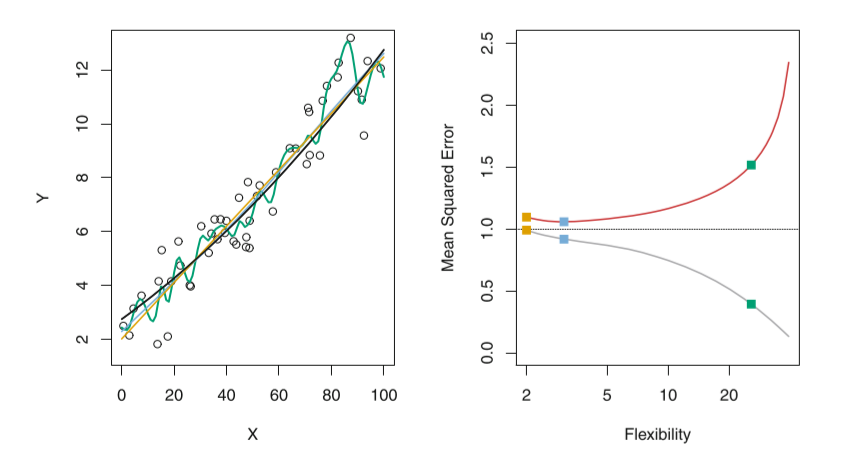
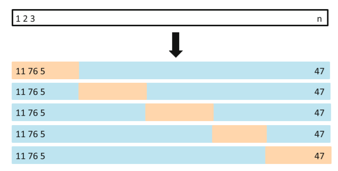
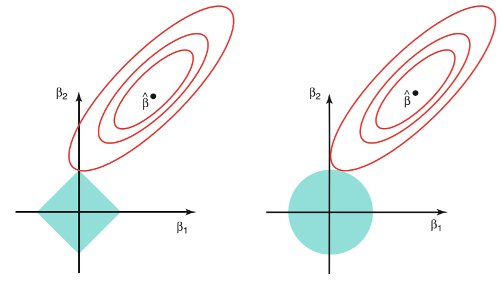

参考：[DataWhale教程链接](https://github.com/datawhalechina/team-learning-data-mining/tree/master/EnsembleLearning)


前面的Task：

[（一）集成学习上——机器学习三大任务](https://blog.csdn.net/youyoufengyuhan/article/details/114853640)

[（二）集成学习上——回归模型](https://blog.csdn.net/youyoufengyuhan/article/details/114994155)


[TOC]

### 2.1.5 <font color=red>评估</font>模型的性能并调参

#### （1） 训练集与测试集

​	在机器学习项目中，有监督学习中，通常是采用我们已经准备好的$(X,y)$数据来训练/拟合模型。其中$X$为样本特征，$y$为拟合的目标值或者类别。我们可以基于既有数据来拟合，将得到的模型在未知$y$的$X$上进行预测$y$。

​	在回归问题的基本算法中，我们使用数据集去估计模型的参数，如线性回归模型中的参数$w$，那么这个数据集我们称为训练数据集，简称训练集。我们在回归问题中使用训练集估计模型的参数的原则一般都是使得我们的损失函数在训练集达到最小值，其实在实际问题中我们是可以让损失函数在训练集最小化为0，如：在线性回归中，我加入非常多的高次项，使得我们模型在训练集的每一个数据点都恰好位于曲线上，那这时候模型在训练集的损失值也就是误差为0。  

​	既然能做到这件事，是不是代表我们的建模完事大吉呢？换句话说我们的模型可以预测任意情况呢？答案是显然否定的。

​	我们建立机器学习的目的并不是为了在已有的数据集，也就是训练集上效果表现非常优异，我们希望建立的机器学习模型在未知且情况复杂的测试数据上表现优异，我们称这样的未出现在训练集的未知数据集成为测试数据集，简称测试集。我们希望模型在测试集上表现优异！假如我们根据股票市场前六个月的数据拟合一个预测模型，我们的目的不是为了预测以前这六个月越准越好，而是希望预测明天乃至未来的股价越准越好。

#### （2） 训练均方误差与测试均方误差

​	在回归中，我们最常用的评价指标为均方误差，即：$MSE = \frac{1}{N}\sum\limits_{i=1}^{N}(y_i -\hat{ f}(x_i))^2$，其中$\hat{ f}(x_i)$是样本$x_i$应用建立的模型$\hat{f}$预测的结果。

​	如果我们所用的数据是训练集上的数据，那么这个误差为训练均方误差，如果我们使用测试集的数据计算的均方误差，我们称为测试均方误差。

​	一般而言，我们并不关心模型在训练集上的训练均方误差，我们关心的是模型面对未知的样本集，即测试集上的测试误差，**我们的目标是使得我们建立的模型在测试集上的测试误差最小**。

​	那我们如何选择一个测试误差最小的模型呢？这是个棘手的问题，因为在模型建立阶段，我们是不能得到测试数据的，比如：我们在模型未上线之前是不能拿到未知且真实的测试数据来验证我们的模型的。

​	在这种情况下，为了简便起见，一些观点认为通过训练误差最小化来选择模型也是可行的。这种观点表面看上去是可行的，但是存在一个致命的缺点，那就是：一个模型的训练均方误差最小时，不能保证测试均方误差同时也很小。对于这种想法构造的模型，一般在训练误差达到最小时，测试均方误差一般很大！

​	如图：

  

左边图：

<font color=black>黑色曲线</font>：真实函数$f$模拟产生的数据

<font color=orange>橙色曲线</font>：$f$的估计1（线性回归拟合）

<font color=green>绿色曲线</font>：$f$的估计2（光滑样条拟合）

<font color=blue>蓝色曲线</font>：$f$的估计3（光滑样条拟合）

右边图：

<font color=grey>灰色曲线</font>：训练均方误差

<font color=red>红色曲线</font>：测试均方误差

所有方法都已使测试均方误差尽可能最小。方块分别对应左图的三种拟合中的训练均方误差和测试均方误差。

观察上图可以看到：

1) 当我们的模型的训练均方误差达到很小时，测试均方误差反而很大，但是我们寻找的最优的模型是测试均方误差达到最小时对应的模型，因此**基于训练均方误差达到最小选择模型本质上是行不通的**。

2) 模型在训练误差很小，但是测试均方误差很大时，我们称这种情况叫模型的**过拟合**。  


#### （3） 偏差与方差的权衡

​	从上图的测试均方误差曲线可以看到：测试均方误差曲线呈现U型曲线，这表明了在测试误差曲线中有两种力量在互相博弈。可以证明：           
$$
E\left(y_{0}-\hat{f}\left(x_{0}\right)\right)^{2}=\operatorname{Var}\left(\hat{f}\left(x_{0}\right)\right)+\left[\operatorname{Bias}\left(\hat{f}\left(x_{0}\right)\right)\right]^{2}+\operatorname{Var}(\varepsilon)
$$
   也就是说，我们的测试均方误差的期望值可以分解为$\hat{f}(x_0)$的方差、$\hat{f}(x_0)$的偏差平方和误差项$\epsilon$的方差。为了使得模型的测试均方误差达到最小值，也就是同时最小化偏差平方$\left[\operatorname{Bias}\left(\hat{f}\left(x_{0}\right)\right)\right]^{2}$和方差$\operatorname{Var}\left(\hat{f}\left(x_{0}\right)\right)$。由于我们知道偏差平方和方差本身是非负的，因此测试均方误差的期望$E\left(y_{0}-\hat{f}\left(x_{0}\right)\right)^{2}$不可能会低于误差的方差$\operatorname{Var}(\varepsilon)$，因此我们称$\operatorname{Var}(\varepsilon)$为建模任务的难度，这个量在我们的任务确定后是无法改变的，也叫做不可约误差。

<font color="green">为什么会选择偏差和方差来刻画测试均方误差，$\operatorname{Var}(\varepsilon)$是无法改变的？无需关心？是否有方法刻画？</font>

<font color=red>[《偏差（Bias）与方差（Variance）》](https://zhuanlan.zhihu.com/p/38853908)有推导讲解</font>

​	**模型的方差**

​	用不同的数据集去估计$f$时，估计函数的改变量。举个例子：我们想要建立一个线性回归模型，可以通过输入中国人身高去预测我们的体重。但是显然我们没有办法把全中国13亿人做一次人口普查，拿到13亿人的身高体重去建立模型。我们能做的就是从13亿中抽1000个样本进行建模，我们对这个抽样的过程重复100遍，就会得到100个1000人的样本集。我们使用线性回归模型估计参数就能得到100个线性回归模型。由于样本抽取具有随机性，我们得到的100个模型不可能参数完全一样，那么这100个模型之间的差异就叫做方差。显然，我们希望得到一个稳定的模型，也就是在不同的样本集估计的模型都不会相差太大，即要求f的方差越小越好。**一般来说，模型的复杂度越高，f的方差就会越大。** 如加入二次项的模型的方差比线性回归模型的方差要大。

<font color=red>方差度量了同一个模型在不同数据集上的稳定性，方差越小，模型稳定性越高。</font>

​	**模型的偏差**

​	为了选择一个简单的模型去估计真实函数所带入的误差。假如真实的数据X与Y的关系是二次关系，但是我们选择了线性模型进行建模，那由于模型的复杂度引起的这种误差我们称为偏差。

<font color=red>偏差度量了学习算法的期望预测与真实结果的偏离程度，度量的是单个模型的学习能力。</font>

​	“偏差-方差分解”说明：**泛化性能是由学习算法的能力、数据的充分性以及学习任务本身的难度所共同决定的**。给定学习任务，为了取得好的泛化性能，则需使偏差较小，即能够充分拟合数据，并且使方差较小，即使得数据扰动产生的影响小。

**一般而言，增加模型的复杂度，会增加模型的方差，但是会减少模型的偏差，我们要找到一个方差--偏差的权衡，使得测试均方误差最小**。

#### （4）怎样降低测试误差

##### ① 特征提取  [原始变量的子集]

​	在前面的讨论中，我们已经明确一个目标，就是：我们要选择一个测试误差达到最小的模型。但是实际上我们很难对实际的测试误差做精确的计算，因此我们要对测试误差进行估计，估计的方式有两种：训练误差修正与交叉验证。 

###### 训练误差修正

​	前面的讨论我们已经知道，**模型越复杂，训练误差越小，测试误差先减后增**。因此，我们先构造一个特征较多的模型使其过拟合，此时训练误差很小而测试误差很大，那这时我们加入关于特征个数的惩罚。因此，当我们的训练误差随着特征个数的增加而减少时，惩罚项因为特征数量的增加而增大，抑制了训练误差随着特征个数的增加而无休止地减小。具体的数学量如下： 
​	$C_p = \frac{1}{N}(RSS  +  2d\hat{\sigma}^2)$，其中$d$为模型特征个数，$RSS = \sum\limits_{i=1}^{N}(y_i-\hat{f}(x_i))^2$，$\hat{\sigma}^2$为模型预测误差的方差的估计值，即残差的方差。

​	<font color=green>预测误差的方差的估计？是预测误差还是训练误差？</font>

​	AIC赤池信息量准则：$AIC = \frac{1}{d\hat{\sigma}^2}(RSS  +  2d\hat{\sigma}^2)$     <font color=green>需要再深入研究研究</font>

​	BIC贝叶斯信息量准则：$BIC = \frac{1}{n}(RSS + log(n)d\hat{\sigma}^2)$ <font color=green>需要再深入研究研究</font>

<font color=red> BIC 的惩罚力度比AIC重</font>

###### 交叉验证

​	前面讨论的对训练误差修正得到测试误差的估计是间接方法，这种方法的桥梁是训练误差，而交叉验证则是对测试误差的直接估计。

​	**交叉验证比训练误差修正的优势在于：能够给出测试误差的一个直接估计**。

​	在这里只介绍K折交叉验证：我们把训练样本分成K等分，然后用$K-1$个样本集当做训练集，剩下的一份样本集为验证集去估计由$K-1$个样本集得到的模型的精度，这个过程重复$K$次取平均值得到测试误差的一个估计$CV_{(K)} = \frac{1}{K}\sum\limits_{i=1}^{K}MSE_i$。5折交叉验证如下图：（蓝色的是训练集，黄色的是验证集） 
   

   在测试误差能够被合理的估计出来以后，我们做特征选择的目标就是：从$p$个特征中选择$m$个特征，使得对应的模型的测试误差的估计最小。对应的方法有：
   - 最优子集选择：
        (i) 记不含任何特征的模型为$M_0$，计算这个$M_0$的测试误差。
        (ii) 在$M_0$基础上增加1个变量【$C_n^1$】，计算$p$个模型的$RSS$，选择$RSS$最小的模型记作$M_1$，并计算该模型$M_1$的测试误差。
        (iii) 再增加1个变量【$C_n^2$】，计算$p-1$个模型的$RSS$，并选择$RSS$最小的模型记作$M_2$，并计算该模型$M_2$的测试误差。
        (iv) 重复以上过程直到拟合的模型有$p$个特征为止，并选择$p+1$个模型$\{M_0,M_1,...,M_p \}$中测试误差最小的模型作为最优模型。 
        <font color=red>累计需要计算 $C_n^1+C_n^2+C_n^3+...+C_n^p=2^p$次</font>
        
   - 向前逐步选择：

        最优子集选择虽然在原理上很直观，但是随着数据特征维度p的增加，子集的数量为$2^p$，计算效率非常低下且需要的计算内存也很高，在大数据的背景下显然不适用。因此，我们需要把最优子集选择的运算效率提高，因此向前逐步选择算法的过程如下：
        
        (i) 记不含任何特征的模型为$M_0$，计算这个$M_0$的测试误差。
(ii) 在$M_0$基础上增加一个变量，计算$p$个模型的$RSS$，选择$RSS$最小的模型记作$M_1$，并计算该模型$M_1$的测试误差。      
        
(iii) **在最小的$RSS$模型下继续增加一个变量**，选择$RSS$最小的模型记作$M_2$，并计算该模型$M_2$的测试误差。
        
(iv) 以此类推，重复以上过程直到拟合的模型有$p$个特征为止，并选择$p+1$个模型$\{M_0,M_1,...,M_p \}$中测试误差最小的模型作为最优模型。  
        
        <font color=red>累计需要计算 $C_n^1$+$C_{n-1}^1$+$C_{n-2}^1$+...+$C_{n-p+1}^1$ 次</font>
        
        <font color=green> 感觉有一些像动态规划的解题思路</font>

##### ② 正则化/压缩估计 [变量系数压缩至零]

​	除了刚刚讨论的直接对特征自身进行选择以外，我们还可以对回归的系数进行约束或者加罚的技巧对$p$个特征的模型进行拟合，显著降低模型方差，这样也会提高模型的拟合效果。具体来说，就是将回归系数往零的方向压缩<font color=red>（相当于特征选择了）</font>，这也就是为什么叫压缩估计的原因了。      

 - 岭回归(L2正则化的例子)：
   
    在线性回归中，我们的损失函数为$J(w) = \sum\limits_{i=1}^{N}(y_i-w_0-\sum\limits_{j=1}^{p}w_jx_{ij})^2$，我们在线性回归的损失函数的基础上添加对系数的约束或者惩罚，即：       

$$
J(w) = \sum\limits_{i=1}^{N}(y_i-w_0-\sum\limits_{j=1}^{p}w_jx_{ij})^2 + \lambda\sum\limits_{j=1}^{p}w_j^2,\;\;其中，\lambda \ge 0\\
     \hat{w} = (X^TX + \lambda I)^{-1}X^TY \\
     I是单位矩阵,\lambda I保证(X^TX + \lambda I)可逆
$$
​	<font color=green>需要自己再推导一下</font>

​	调节参数$\lambda$的大小是影响压缩估计的关键，$\lambda$越大，惩罚的力度越大，系数则越趋近于0，反之，选择合适的$\lambda$对模型精度来说十分重要。岭回归通过牺牲线性回归的无偏性降低方差，有可能使得模型整体的测试误差较小，提高模型的泛化能力。 

- Lasso回归(L1正则化的例子)： 
  
  岭回归的一个很显著的特点是：将模型的系数往零的方向压缩，但是岭回归的系数只能趋于0但无法等于0，换句话说，就是**无法做特征选择**。
  
  能否使用压缩估计的思想做到**像特征最优子集选择那样提取出重要的特征**呢？答案是肯定的！
  
  我们只需要对岭回归的优化函数做小小的调整就行了，我们使用系数向量的L1范数替换岭回归中的L2范数：

$$
J(w) = \sum\limits_{i=1}^{N}(y_i-w_0-\sum\limits_{j=1}^{p}w_jx_{ij})^2 + \lambda\sum\limits_{j=1}^{p}|w_j|,\;\;其中，\lambda \ge 0
$$
​		**为什么Losso能做到特征选择而岭回归却不能呢个做到呢？**(如图：左边为lasso，右边为岭回归)  

​	<font color=red>Lasso如何求解最优解，请看LARS最小角回归</font>

​		<font color=green>需要再重新思考一下为什么，怎么理解L1是菱形的，L2是圆形的，何为约束下的回归？</font>

    

   椭圆形曲线为$RSS$等高线，菱形和圆形区域分别代表了L1和L2约束，Lasso回归和岭回归都是在约束下的回归，因此最优的参数为椭圆形曲线与菱形和圆形区域相切的点。但是Lasso回归的约束在每个坐标轴上都有拐角，因此当$RSS$曲线与坐标轴相交时恰好回归系数中的某一个为0，这样就实现了特征提取。反观岭回归的约束是一个圆域，没有尖点，因此与$RSS$曲线相交的地方一般不会出现在坐标轴上，因此无法让某个特征的系数为0，因此无法做到特征提取。

​	

##### ③ 降维  [原始的特征空间投影到一个低维空间]

​	到目前为止，我们所讨论的方法对方差的控制有两种方式：一种是使用原始变量的子集，另一种是将变量系数压缩至零。但是这些方法都是基于原始特征$x_1,...,x_p$得到的，现在我们探讨一类新的方法：将原始的特征空间投影到一个低维的空间实现变量的数量变少，如：将二维的平面投影至一维空间。

​	机器学习领域中所谓的降维就是指采用某种映射方法，将原高维空间中的数据点映射到低维度的空间中。

​	降维的本质是学习一个映射函数 $f : x->y$，其中$x$是原始数据点的表达，目前最多使用向量表达形式。 $y$是数据点映射后的低维向量表达，通常$y$的维度小于$x$的维度（当然提高维度也是可以的）。$f$可能是显式的或隐式的、线性的或非线性的。

​	目前大部分降维算法处理向量表达的数据，也有一些降维算法处理高阶张量表达的数据。

​	之所以使用降维后的数据表示是因为在原始的高维空间中，包含有冗余信息以及噪音信息，在实际应用例如图像识别中造成了误差，降低了准确率。而通过降维，我们希望**减少冗余信息所造成的误差，提高识别（或其他应用）的精度**。又或者希望通过降维算法来**寻找数据内部的本质结构特征**。在很多算法中，降维算法成为了数据预处理的一部分，如PCA。事实上，有一些算法如果没有降维预处理，其实是很难得到很好的效果的。 


###### PCA（主成分分析）降维

​	<font color=green>还没搞懂PCA ，o(╥﹏╥)o</font>

>    主成分分析的思想：通过**最大投影方差** 将原始空间进行重构，即由特征相关重构为无关，即落在某个方向上的点(投影)的方差最大。在进行下一步推导之前，我们先把样本均值和样本协方差矩阵推广至矩阵形式： 
> 	样本均值Mean:$\bar{x} = \frac{1}{N}\sum\limits_{i=1}^{N}x_i =  \frac{1}{N}X^T1_N,\;\;\;其中1_N = (1,1,...,1)_{N}^T$     
>
> ​	样本协方差矩阵$S^2 = \frac{1}{N}\sum\limits_{i=1}^{N}(x_i-\bar{x})(x_i-\bar{x})^T = \frac{1}{N}X^THX,\;\;\;其中，H = I_N - \frac{1}{N}1_N1_N^T$         
>
> ​	最大投影方差的步骤：       
>
> ​	 (i) 中心化：$x_i - \bar{x}$      
>
> ​	 (ii) 计算每个点$x_1,...,x_N$至$\vec{u}_1$方向上的投影：$(x_i-\bar{x})\vec{u}_1,\;\;\;||\vec{u}_1|| = 1$         
>
> ​	 (iii) 计算投影方差：$J = \frac{1}{N}\sum\limits_{i=1}^{N}[(x_i-\bar{x})^T\vec{u}_1]^2,\;\;\;||\vec{u}_1|| = 1$       
>
> ​	(iv) 最大化投影方差求$\vec{u}_1$：           
> $$
>    \bar{u}_1 = argmax_{u_1}\;\;\frac{1}{N}\sum\limits_{i=1}^{N}[(x_i-\bar{x})^T\vec{u}_1]^2 \\
>    \;\;\;s.t. \vec{u}_1^T\vec{u}_1 = 1 (\vec{u}_1往后不带向量符号)
> $$
>    得到：   
> $$
> J = \frac{1}{N}\sum\limits_{i=1}^{N}[(x_i-\bar{x})^T\vec{u}_1]^2  = \frac{1}{N}\sum\limits_{i=1}^{N}[u_1^T(x_i-\bar{x})(x_i-\bar{x})^Tu_1]\\
>    \; = u_1^T[\frac{1}{N}\sum\limits_{i=1}^{N}(x_i-\bar{x})(x_i - \bar{x})^T]u_1 = u_1^TS^2u_1
> $$
>    即：           
> $$
>    \hat{u}_1 = argmax_{u_1}u_1^TS^2u_1,\;\;\;s.t.u_1^Tu_1 = 1\\
>    L(u_1,\lambda) = u_1^TS^2u_1 + \lambda (1-u_1^Tu_1)\\
>    \frac{\partial L}{\partial u_1} = 2S^2u_1-2\lambda u_1 = 0\\
>    即：S^2u_1 = \lambda u_1
> $$
>    可以看到：$\lambda$为$S^2$的特征值，$u_1$为$S^2$的特征向量。因此我们只需要对中心化后的协方差矩阵进行特征值分解，得到的特征向量即为投影方向。如果需要进行降维，那么只需要取$p$的前$M$个特征向量即可。
>

#### （5） 线性回归的优化应用

##### ① 特征提取——向前逐步回归

案例来源：https://blog.csdn.net/weixin_44835596/article/details/89763300        

根据AIC准则定义向前逐步回归进行变量筛选


```python
#定义向前逐步回归函数
def forward_select(data,target):
    variate=set(data.columns)  #将字段名转换成字典类型
    variate.remove(target)  #去掉因变量的字段名
    selected=[]
    current_score,best_new_score=float('inf'),float('inf')  #目前的分数和最好分数初始值都为无穷大（因为AIC越小越好）
    #循环筛选变量
    while variate:
        aic_with_variate=[]
        for candidate in variate:  #逐个遍历自变量
            formula="{}~{}".format(target,"+".join(selected+[candidate]))  #将自变量名连接起来
            aic=ols(formula=formula,data=data).fit().aic  #利用ols训练模型得出aic值
            aic_with_variate.append((aic,candidate))  #将第每一次的aic值放进空列表
        aic_with_variate.sort(reverse=True)  #降序排序aic值
        best_new_score,best_candidate=aic_with_variate.pop()  #最好的aic值等于删除列表的最后一个值，以及最好的自变量等于列表最后一个自变量
        if current_score>best_new_score:  #如果目前的aic值大于最好的aic值
            variate.remove(best_candidate)  #移除加进来的变量名，即第二次循环时，不考虑此自变量了
            selected.append(best_candidate)  #将此自变量作为加进模型中的自变量
            current_score=best_new_score  #最新的分数等于最好的分数
            print("aic is {},continuing!".format(current_score))  #输出最小的aic值
        else:
            print("for selection over!")
            break
    formula="{}~{}".format(target,"+".join(selected))  #最终的模型式子
    print("final formula is {}".format(formula))
    model=ols(formula=formula,data=data).fit()
    return(model)
```


```python
import statsmodels.api as sm #最小二乘
from statsmodels.formula.api import ols #加载ols模型
forward_select(data=boston_data,target="Price")
```

    aic is 3286.974956900157,continuing!
    aic is 3171.5423142992013,continuing!
    aic is 3114.0972674193326,continuing!
    aic is 3097.359044862759,continuing!
    aic is 3069.438633167217,continuing!
    aic is 3057.9390497191152,continuing!
    aic is 3048.438382711162,continuing!
    aic is 3042.274993098419,continuing!
    aic is 3040.154562175143,continuing!
    aic is 3032.0687017003256,continuing!
    aic is 3021.726387825062,continuing!
    for selection over!
    final formula is Price~LSTAT+RM+PTRATIO+DIS+NOX+CHAS+B+ZN+CRIM+RAD+TAX


    <statsmodels.regression.linear_model.RegressionResultsWrapper at 0x16b15545fd0>


```python
lm=ols("Price~LSTAT+RM+PTRATIO+DIS+NOX+CHAS+B+ZN+CRIM+RAD+TAX",data=boston_data).fit()
lm.summary()
```


<table class="simpletable">
<caption>OLS Regression Results</caption>
<tr>
  <th>Dep. Variable:</th>          <td>Price</td>      <th>  R-squared:         </th> <td>   0.741</td> 
</tr>
<tr>
  <th>Model:</th>                   <td>OLS</td>       <th>  Adj. R-squared:    </th> <td>   0.735</td> 
</tr>
<tr>
  <th>Method:</th>             <td>Least Squares</td>  <th>  F-statistic:       </th> <td>   128.2</td> 
</tr>
<tr>
  <th>Date:</th>             <td>Sun, 14 Mar 2021</td> <th>  Prob (F-statistic):</th> <td>5.54e-137</td>
</tr>
<tr>
  <th>Time:</th>                 <td>20:49:31</td>     <th>  Log-Likelihood:    </th> <td> -1498.9</td> 
</tr>
<tr>
  <th>No. Observations:</th>      <td>   506</td>      <th>  AIC:               </th> <td>   3022.</td> 
</tr>
<tr>
  <th>Df Residuals:</th>          <td>   494</td>      <th>  BIC:               </th> <td>   3072.</td> 
</tr>
<tr>
  <th>Df Model:</th>              <td>    11</td>      <th>                     </th>     <td> </td>    
</tr>
<tr>
  <th>Covariance Type:</th>      <td>nonrobust</td>    <th>                     </th>     <td> </td>    
</tr>
</table>
<table class="simpletable">
<tr>
      <td></td>         <th>coef</th>     <th>std err</th>      <th>t</th>      <th>P>|t|</th>  <th>[0.025</th>    <th>0.975]</th>  
</tr>
<tr>
  <th>Intercept</th> <td>   36.3411</td> <td>    5.067</td> <td>    7.171</td> <td> 0.000</td> <td>   26.385</td> <td>   46.298</td>
</tr>
<tr>
  <th>LSTAT</th>     <td>   -0.5226</td> <td>    0.047</td> <td>  -11.019</td> <td> 0.000</td> <td>   -0.616</td> <td>   -0.429</td>
</tr>
<tr>
  <th>RM</th>        <td>    3.8016</td> <td>    0.406</td> <td>    9.356</td> <td> 0.000</td> <td>    3.003</td> <td>    4.600</td>
</tr>
<tr>
  <th>PTRATIO</th>   <td>   -0.9465</td> <td>    0.129</td> <td>   -7.334</td> <td> 0.000</td> <td>   -1.200</td> <td>   -0.693</td>
</tr>
<tr>
  <th>DIS</th>       <td>   -1.4927</td> <td>    0.186</td> <td>   -8.037</td> <td> 0.000</td> <td>   -1.858</td> <td>   -1.128</td>
</tr>
<tr>
  <th>NOX</th>       <td>  -17.3760</td> <td>    3.535</td> <td>   -4.915</td> <td> 0.000</td> <td>  -24.322</td> <td>  -10.430</td>
</tr>
<tr>
  <th>CHAS</th>      <td>    2.7187</td> <td>    0.854</td> <td>    3.183</td> <td> 0.002</td> <td>    1.040</td> <td>    4.397</td>
</tr>
<tr>
  <th>B</th>         <td>    0.0093</td> <td>    0.003</td> <td>    3.475</td> <td> 0.001</td> <td>    0.004</td> <td>    0.015</td>
</tr>
<tr>
  <th>ZN</th>        <td>    0.0458</td> <td>    0.014</td> <td>    3.390</td> <td> 0.001</td> <td>    0.019</td> <td>    0.072</td>
</tr>
<tr>
  <th>CRIM</th>      <td>   -0.1084</td> <td>    0.033</td> <td>   -3.307</td> <td> 0.001</td> <td>   -0.173</td> <td>   -0.044</td>
</tr>
<tr>
  <th>RAD</th>       <td>    0.2996</td> <td>    0.063</td> <td>    4.726</td> <td> 0.000</td> <td>    0.175</td> <td>    0.424</td>
</tr>
<tr>
  <th>TAX</th>       <td>   -0.0118</td> <td>    0.003</td> <td>   -3.493</td> <td> 0.001</td> <td>   -0.018</td> <td>   -0.005</td>
</tr>
</table>
<table class="simpletable">
<tr>
  <th>Omnibus:</th>       <td>178.430</td> <th>  Durbin-Watson:     </th> <td>   1.078</td> 
</tr>
<tr>
  <th>Prob(Omnibus):</th> <td> 0.000</td>  <th>  Jarque-Bera (JB):  </th> <td> 787.785</td> 
</tr>
<tr>
  <th>Skew:</th>          <td> 1.523</td>  <th>  Prob(JB):          </th> <td>8.60e-172</td>
</tr>
<tr>
  <th>Kurtosis:</th>      <td> 8.300</td>  <th>  Cond. No.          </th> <td>1.47e+04</td> 
</tr>
</table><br/><br/>Notes:<br/>[1] Standard Errors assume that the covariance matrix of the errors is correctly specified.<br/>[2] The condition number is large, 1.47e+04. This might indicate that there are<br/>strong multicollinearity or other numerical problems.


##### ② [正则化-岭回归](https://scikit-learn.org/stable/modules/generated/sklearn.linear_model.Ridge.html#sklearn.linear_model.Ridge)

`class sklearn.linear_model.Ridge (alpha=1.0, fit_intercept=True, normalize=False, copy_X=True, max_iter=None,
tol=0.001, solver=’auto’, random_state=None)`

   - 参数： 
      `alpha`：较大的值表示更强的正则化。浮点数                   
      
      `sample_weight`：样本权重，默认无。  
      
      `solver`：求解方法，可选参数有：{‘auto’, ‘svd’, ‘cholesky’, ‘lsqr’, ‘sparse_cg’, ‘sag’, ‘saga’}，默认值为'auto'。
      
      - 'svd' 使用X的奇异值分解来计算Ridge系数，对于奇异矩阵，比'cholesky'更稳定。
      
      - 'cholesky' 使用标准的scipy.linalg.solve函数通过dot（XT，X）的Cholesky分解获得封闭形式的解。
      
      - 'sparse_cg' 使用scipy.sparse.linalg.cg中的共轭梯度求解器。作为一种迭代算法，对于大规模数据（可能设置tol和max_iter），此求解器比“ Cholesky”更合适。 
      
      - 'lsqr'使用专用的正则化最小二乘例程scipy.sparse.linalg.lsqr。它是最快的，并且使用迭代过程。
      
      - 'sag'使用随机平均梯度下降，'saga'使用其改进的无偏版本saga。两种方法都使用迭代过程，并且当n_samples和n_features都很大时，通常比其他求解器更快。请注意，只有在比例大致相同的特征上才能确保“ sag”和“ saga”快速收敛。可以使用sklearn.preprocessing中的缩放器对数据进行预处理。
      
        最后，五个求解器均支持密集和稀疏数据。但是，当fit_intercept为True时，仅'sag'和'sparse_cg'支持稀疏输入。

```python
from sklearn import linear_model
reg_rid = linear_model.Ridge(alpha=.5)
reg_rid.fit(X,y)
reg_rid.score(X,y)
```


    0.739957023371629


##### ③ [正则化-Lasso回归](https://scikit-learn.org/stable/modules/generated/sklearn.linear_model.Lasso.html#sklearn.linear_model.Lasso)

`class sklearn.linear_model.Lasso (alpha=1.0, fit_intercept=True, normalize=False, precompute=False,
copy_X=True, max_iter=1000, tol=0.0001, warm_start=False, positive=False, random_state=None, selection=’cyclic’)
ai`

   - 参数：                
     
      alpha：正则化强度，1.0代表标准最小二乘。                
      
      fit_intercept：是否计算模型截距。默认true。     
      
      normalize：是否标准化，默认false。                   
      
      positive：是否强制系数为正，默认false。


```python
from sklearn import linear_model
reg_lasso = linear_model.Lasso(alpha = 0.5)
reg_lasso.fit(X,y)
reg_lasso.score(X,y)
```


    0.7140164719858566

- 系数估计

萌弟：对了，各位，我在lasso回归的时候没有告诉大家lasso的系数估计的方法，感兴趣的可以看看Lars模型，这个模型就是估计lasso的方法，因为这个lasso用的是绝对值，不可导，因此很难使用梯度下降算法取估计系数，在很多软件都是用Lars的。


拓展学习资料：

最优化算法 https://zhuanlan.zhihu.com/p/136185624
数学优化方法 https://zhuanlan.zhihu.com/p/42522867 
统计学习基础翻译 https://esl.hohoweiya.xyz/ 