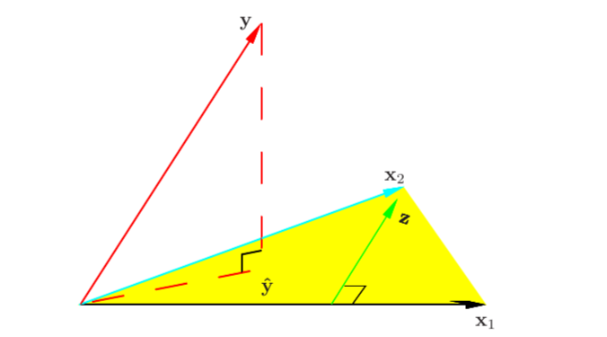
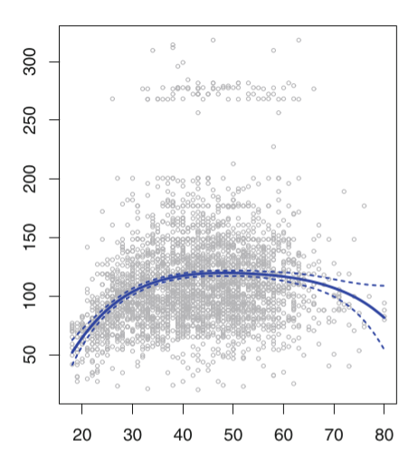
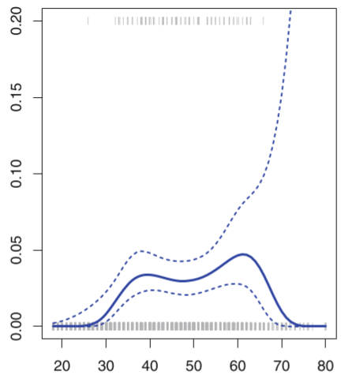
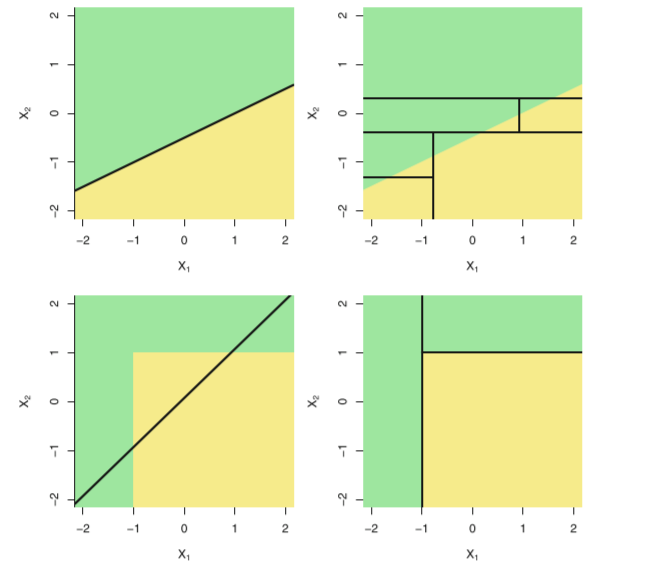

# 2. 使用sklearn构建完整的机器学习项目流程

一般来说，一个完整的机器学习项目分为以下步骤：
   1. 明确解决问题的模型类型：<font color=red>回归/分类</font>
   2. 收集数据集并选择合适的<font color=red>特征</font>。
   3. 选择度量模型性能的<font color=red>指标</font>。
   4. 选择具体的<font color=red>模型</font>并进行训练以优化模型。
   5. <font color=red>评估</font>模型的性能并调参。

## 2.1 使用sklearn构建完整的回归项目

   ### 2.1.1 明确解决问题的模型类型：<font color=red>回归/分类</font>
   本次实践项目为回归项目。    
   ### 2.1.2 收集数据集并选择合适的<font color=red>特征</font>
   数据集上我们使用上一节尝试过的Boston房价数据集。    


```python
# 引入相关科学计算包
import numpy as np
import pandas as pd
import matplotlib.pyplot as plt
%matplotlib inline 
plt.style.use("ggplot")      # 样式美化
import seaborn as sns
from sklearn import datasets
boston = datasets.load_boston()     # 返回一个类似于字典的类
X = boston.data
y = boston.target
features = boston.feature_names
boston_data = pd.DataFrame(X,columns=features)
boston_data["Price"] = y
boston_data.head()
```


<table border="1" class="dataframe">
  <thead>
    <tr style="text-align: right;">
      <th></th>
      <th>CRIM</th>
      <th>ZN</th>
      <th>INDUS</th>
      <th>CHAS</th>
      <th>NOX</th>
      <th>RM</th>
      <th>AGE</th>
      <th>DIS</th>
      <th>RAD</th>
      <th>TAX</th>
      <th>PTRATIO</th>
      <th>B</th>
      <th>LSTAT</th>
      <th>Price</th>
    </tr>
  </thead>
  <tbody>
    <tr>
      <th>0</th>
      <td>0.00632</td>
      <td>18.0</td>
      <td>2.31</td>
      <td>0.0</td>
      <td>0.538</td>
      <td>6.575</td>
      <td>65.2</td>
      <td>4.0900</td>
      <td>1.0</td>
      <td>296.0</td>
      <td>15.3</td>
      <td>396.90</td>
      <td>4.98</td>
      <td>24.0</td>
    </tr>
    <tr>
      <th>1</th>
      <td>0.02731</td>
      <td>0.0</td>
      <td>7.07</td>
      <td>0.0</td>
      <td>0.469</td>
      <td>6.421</td>
      <td>78.9</td>
      <td>4.9671</td>
      <td>2.0</td>
      <td>242.0</td>
      <td>17.8</td>
      <td>396.90</td>
      <td>9.14</td>
      <td>21.6</td>
    </tr>
    <tr>
      <th>2</th>
      <td>0.02729</td>
      <td>0.0</td>
      <td>7.07</td>
      <td>0.0</td>
      <td>0.469</td>
      <td>7.185</td>
      <td>61.1</td>
      <td>4.9671</td>
      <td>2.0</td>
      <td>242.0</td>
      <td>17.8</td>
      <td>392.83</td>
      <td>4.03</td>
      <td>34.7</td>
    </tr>
    <tr>
      <th>3</th>
      <td>0.03237</td>
      <td>0.0</td>
      <td>2.18</td>
      <td>0.0</td>
      <td>0.458</td>
      <td>6.998</td>
      <td>45.8</td>
      <td>6.0622</td>
      <td>3.0</td>
      <td>222.0</td>
      <td>18.7</td>
      <td>394.63</td>
      <td>2.94</td>
      <td>33.4</td>
    </tr>
    <tr>
      <th>4</th>
      <td>0.06905</td>
      <td>0.0</td>
      <td>2.18</td>
      <td>0.0</td>
      <td>0.458</td>
      <td>7.147</td>
      <td>54.2</td>
      <td>6.0622</td>
      <td>3.0</td>
      <td>222.0</td>
      <td>18.7</td>
      <td>396.90</td>
      <td>5.33</td>
      <td>36.2</td>
    </tr>
  </tbody>
</table>
各个特征的相关解释：
   - CRIM：各城镇的人均犯罪率
   - ZN：规划地段超过25,000平方英尺的住宅用地比例
   - INDUS：城镇非零售商业用地比例
   - CHAS：是否在查尔斯河边(=1是)
   - NOX：一氧化氮浓度(/千万分之一)
   - RM：每个住宅的平均房间数
   - AGE：1940年以前建造的自住房屋的比例
   - DIS：到波士顿五个就业中心的加权距离
   - RAD：放射状公路的可达性指数
   - TAX：全部价值的房产税率(每1万美元)
   - PTRATIO：按城镇分配的学生与教师比例
   - B：1000(Bk - 0.63)^2其中Bk是每个城镇的黑人比例
   - LSTAT：较低地位人口
   - Price：房价

  ### 2.1.3 选择度量模型性能的<font color=red>指标</font>
   - MSE均方误差： $\text{MSE}(y, \hat{y}) = \frac{1}{n_\text{samples}} \sum_{i=0}^{n_\text{samples} - 1} (y_i - \hat{y}_i)^2.$
   - MAE平均绝对误差:$\text{MAE}(y, \hat{y}) = \frac{1}{n_{\text{samples}}} \sum_{i=0}^{n_{\text{samples}}-1} \left| y_i - \hat{y}_i \right|$
   - $R^2$决定系数：$R^2(y, \hat{y}) = 1 - \frac{\sum_{i=1}^{n} (y_i - \hat{y}_i)^2}{\sum_{i=1}^{n} (y_i - \bar{y})^2}$
   - 解释方差得分:$explained\_{}variance(y, \hat{y}) = 1 - \frac{Var\{ y - \hat{y}\}}{Var\{y\}}$

https://scikit-learn.org/stable/modules/model_evaluation.html#regression-metrics

              
在这个案例中，我们使用MSE均方误差为模型的性能度量指标。

   ### 2.1.4 选择具体的<font color=red>模型</font>并进行训练以优化模型。

   - **线性回归模型**         
      回归这个概念是19世纪80年代由英国统计学家郎西斯.高尔顿在研究父子身高关系提出来的，他发现：在同一族群中，子代的平均身高介于父代的身高以及族群的平均身高之间。具体而言，高个子父亲的儿子的身高有低于其父亲身高的趋势，而矮个子父亲的儿子身高则有高于父亲的身高的趋势。也就是说，子代的身高有向族群平均身高"平均"的趋势，这就是统计学上"回归"的最初含义。回归分析是一种预测性的建模技术，它研究的是因变量（目标）和自变量（特征）之间的关系。这种技术通常用于预测分析，时间序列模型以及发现变量之间的因果关系。通常使用曲线/线来拟合数据点，目标是使曲线到数据点的距离差异最小。而线性回归就是回归问题中的一种，线性回归假设目标值与特征之间线性相关，即满足一个多元一次方程。通过构建损失函数，来求解损失函数最小时的参数w ：                                                
      假设：数据集$D = \{(x_1,y_1),...,(x_N,y_N) \}$，$x_i \in R^p,y_i \in R,i = 1,2,...,N$，$X = (x_1,x_2,...,x_N)^T,Y=(y_1,y_2,...,y_N)^T$                        
      假设X和Y之间存在线性关系，模型的具体形式为$\hat{y}=f(w) =w^Tx$           
            
      (a) 最小二乘估计：                 
      我们需要衡量真实值$y_i$与线性回归模型的预测值$w^Tx_i$之间的差距，在这里我们和使用二范数的平方和L(w)来描述这种差距，即：                      
$$
L(w) = \sum\limits_{i=1}^{N}||w^Tx_i-y_i||_2^2=\sum\limits_{i=1}^{N}(w^Tx_i-y_i)^2 = (w^TX^T-Y^T)(w^TX^T-Y^T)^T = w^TX^TXw - 2w^TX^TY+YY^T\\
   因此，我们需要找到使得L(w)最小时对应的参数w，即：\\
   \hat{w} = argmin\;L(w)\\
   为了达到求解最小化L(w)问题，我们应用高等数学的知识，使用求导来解决这个问题： \\
   \frac{\partial L(w)}{\partial w} = 2X^TXw-2X^TY = 0,因此： \\
   \hat{w} = (X^TX)^{-1}X^TY
$$
   (b) 几何解释：                
   在线性代数中，我们知道两个向量a和b相互垂直可以得出：$<a,b> = a.b = a^Tb = 0$,而平面X的法向量为Y-Xw，与平面X互相垂直，因此：$X^T(Y-Xw) = 0$，即：$w = (X^TX)^{-1}X^TY$                             
                  
   (c) 概率视角：       
   假设噪声$\epsilon \backsim N(0,\sigma^2),y=f(w)+\epsilon=w^Tx+\epsilon$，因此：$y|x_i,w ~ N(w^Tx,\sigma^2)$          
   我们使用极大似然估计MLE对参数w进行估计：       
$$
L(w) = log\;P(Y|X;w) = log\;\prod_{i=1}^N P(y_i|x_i;w) = \sum\limits_{i=1}^{N} log\; P(y_i|x_i;w)\\
    = \sum\limits_{i=1}^{N}log(\frac{1}{\sqrt{2\pi \sigma}}exp(-\frac{(y_i-w^Tx_i)^2}{2\sigma^2})) = \sum\limits_{i=1}^{N}[log(\frac{1}{\sqrt{2\pi}\sigma})-\frac{1}{2\sigma^2}(y_i-w^Tx_i)^2] \\
    argmax_w L(w) = argmin_w[l(w) = \sum\limits_{i = 1}^{N}(y_i-w^Tx_i)^2]\\
    因此：线性回归的最小二乘估计<==>噪声\epsilon\backsim N(0,\sigma^2)的极大似然估计
$$

 下面，我们使用sklearn的线性回归实例来演示：                   
https://scikit-learn.org/stable/modules/generated/sklearn.linear_model.LinearRegression.html#sklearn.linear_model.LinearRegression


```python
from sklearn import linear_model      # 引入线性回归方法
lin_reg = linear_model.LinearRegression()       # 创建线性回归的类
lin_reg.fit(X,y)        # 输入特征X和因变量y进行训练
print("模型系数：",lin_reg.coef_)             # 输出模型的系数
print("模型得分：",lin_reg.score(X,y))    # 输出模型的决定系数R^2
```

    模型系数： [-1.08011358e-01  4.64204584e-02  2.05586264e-02  2.68673382e+00
     -1.77666112e+01  3.80986521e+00  6.92224640e-04 -1.47556685e+00
      3.06049479e-01 -1.23345939e-02 -9.52747232e-01  9.31168327e-03
     -5.24758378e-01]
    模型得分： 0.7406426641094095


   - **线性回归的推广**                     
      在线性回归中，我们假设因变量与特征之间的关系是线性关系，这样的假设使得模型很简单，但是缺点也是显然的，那就是当数据存在非线性关系时，我们使用线性回归模型进行预测会导致预测性能极其低下，因为模型的形式本身是线性的，无法表达数据中的非线性关系。我们一个很自然的想法就是去推广线性回归模型，使得推广后的模型更能表达非线性的关系。                     
      (a) 多项式回归：        
      为了体现因变量和特征的非线性关系，一个很自然而然的想法就是将标准的线性回归模型：             
$$
   y_i = w_0 + w_1x_i + \epsilon_i
$$
   换成一个多项式函数：          
$$
y_i = w_0 + w_1x_i + w_2x_i^2 + ...+w_dx_i^d + \epsilon
$$
   对于多项式的阶数d不能取过大，一般不大于3或者4，因为d越大，多项式曲线就会越光滑，在X的边界处有异常的波动。（图中的边界处的4阶多项式拟合曲线的置信区间(虚线表示置信区间)明显增大，预测效果的稳定性下降。）   

                                 

   (b) 广义可加模型(GAM)：         
   广义可加模型GAM实际上是线性模型推广至非线性模型的一个框架，在这个框架中，每一个变量都用一个非线性函数来代替，但是模型本身保持整体可加性。GAM模型不仅仅可以用在线性回归的推广，还可以将线性分类模型进行推广。具体的推广形式是：          
   标准的线性回归模型：           
$$
   y_i = w_0 + w_1x_{i1} +...+w_px_{ip} + \epsilon_i 
$$
   GAM模型框架：                  
$$
   y_i = w_0 + \sum\limits_{j=1}^{p}f_{j}(x_{ij}) + \epsilon_i
$$
   GAM模型的优点与不足：             
      - 优点：简单容易操作，能够很自然地推广线性回归模型至非线性模型，使得模型的预测精度有所上升；由于模型本身是可加的，因此GAM还是能像线性回归模型一样把其他因素控制不变的情况下单独对某个变量进行推断，极大地保留了线性回归的易于推断的性质。
      - 缺点：GAM模型会经常忽略一些有意义的交互作用，比如某两个特征共同影响因变量，不过GAM还是能像线性回归一样加入交互项$x^{(i)} \times x^{(j)}$的形式进行建模；但是GAM模型本质上还是一个可加模型，如果我们能摆脱可加性模型形式，可能还会提升模型预测精度，详情请看后面的算法。
     

(a) 多项式回归实例介绍：                    
https://scikit-learn.org/stable/modules/generated/sklearn.preprocessing.PolynomialFeatures.html?highlight=poly#sklearn.preprocessing.PolynomialFeatures                              
sklearn.preprocessing.PolynomialFeatures(degree=2, *, interaction_only=False, include_bias=True, order='C'):               

   - 参数：         
      degree：特征转换的阶数。                       
      interaction_onlyboolean：是否只包含交互项，默认False 。              
      include_bias：是否包含截距项，默认True。           
      order：str in {‘C’, ‘F’}, default ‘C’，输出数组的顺序。     


```python
from sklearn.preprocessing import PolynomialFeatures
X_arr = np.arange(12).reshape(3, 4)
print("原始X为：\n",X_arr)

poly = PolynomialFeatures(2)
print("2次转化X：\n",poly.fit_transform(X_arr))

poly = PolynomialFeatures(interaction_only=True)
print("2次转化X：\n",poly.fit_transform(X_arr))
```

    原始X为：
     [[ 0  1  2  3]
     [ 4  5  6  7]
     [ 8  9 10 11]]
    2次转化X：
     [[  1.   0.   1.   2.   3.   0.   0.   0.   0.   1.   2.   3.   4.   6.
        9.]
     [  1.   4.   5.   6.   7.  16.  20.  24.  28.  25.  30.  35.  36.  42.
       49.]
     [  1.   8.   9.  10.  11.  64.  72.  80.  88.  81.  90.  99. 100. 110.
      121.]]
    2次转化X：
     [[  1.   0.   1.   2.   3.   0.   0.   0.   2.   3.   6.]
     [  1.   4.   5.   6.   7.  20.  24.  28.  30.  35.  42.]
     [  1.   8.   9.  10.  11.  72.  80.  88.  90.  99. 110.]]

(b) GAM模型实例介绍：          
安装pygam：pip install pygam               
https://github.com/dswah/pyGAM/blob/master/doc/source/notebooks/quick_start.ipynb                     


```python
from pygam import LinearGAM
gam = LinearGAM().fit(boston_data[boston.feature_names], y)
gam.summary()
```

    LinearGAM                                                                                                 
    =============================================== ==========================================================
    Distribution:                        NormalDist Effective DoF:                                    103.2423
    Link Function:                     IdentityLink Log Likelihood:                                 -1589.7653
    Number of Samples:                          506 AIC:                                             3388.0152
                                                    AICc:                                            3442.7649
                                                    GCV:                                               13.7683
                                                    Scale:                                              8.8269
                                                    Pseudo R-Squared:                                   0.9168
    ==========================================================================================================
    Feature Function                  Lambda               Rank         EDoF         P > x        Sig. Code   
    ================================= ==================== ============ ============ ============ ============
    s(0)                              [0.6]                20           11.1         2.20e-11     ***         
    s(1)                              [0.6]                20           12.8         8.15e-02     .           
    s(2)                              [0.6]                20           13.5         2.59e-03     **          
    s(3)                              [0.6]                20           3.8          2.76e-01                 
    s(4)                              [0.6]                20           11.4         1.11e-16     ***         
    s(5)                              [0.6]                20           10.1         1.11e-16     ***         
    s(6)                              [0.6]                20           10.4         8.22e-01                 
    s(7)                              [0.6]                20           8.5          4.44e-16     ***         
    s(8)                              [0.6]                20           3.5          5.96e-03     **          
    s(9)                              [0.6]                20           3.4          1.33e-09     ***         
    s(10)                             [0.6]                20           1.8          3.26e-03     **          
    s(11)                             [0.6]                20           6.4          6.25e-02     .           
    s(12)                             [0.6]                20           6.5          1.11e-16     ***         
    intercept                                              1            0.0          2.23e-13     ***         
    ==========================================================================================================
    Significance codes:  0 '***' 0.001 '**' 0.01 '*' 0.05 '.' 0.1 ' ' 1
    
    WARNING: Fitting splines and a linear function to a feature introduces a model identifiability problem
             which can cause p-values to appear significant when they are not.
    
    WARNING: p-values calculated in this manner behave correctly for un-penalized models or models with
             known smoothing parameters, but when smoothing parameters have been estimated, the p-values
             are typically lower than they should be, meaning that the tests reject the null too readily.


    
    <ipython-input-13-bb049c74476f>:3: UserWarning: KNOWN BUG: p-values computed in this summary are likely much smaller than they should be. 
     
    Please do not make inferences based on these values! 
    
    Collaborate on a solution, and stay up to date at: 
    github.com/dswah/pyGAM/issues/163 
    
      gam.summary()


   - **回归树：**                                   
      基于树的回归方法主要是依据分层和分割的方式将特征空间划分为一系列简单的区域。对某个给定的待预测的自变量，用他所属区域中训练集的平均数或者众数对其进行预测。由于划分特征空间的分裂规则可以用树的形式进行概括，因此这类方法称为决策树方法。决策树由结点(node)和有向边(diredcted edge)组成。结点有两种类型：内部结点(internal node)和叶结点(leaf node)。内部结点表示一个特征或属性，叶结点表示一个类别或者某个值。区域$R_1,R_2$等称为叶节点，将特征空间分开的点为内部节点。                           
                           
      建立回归树的过程大致可以分为以下两步：          
      - 将自变量的特征空间(即$x^{(1)},x^{(2)},x^{(3)},...,x^{(p)}$)的可能取值构成的集合分割成J个互不重叠的区域$R_1,R_2,...,R_j$。        
      - 对落入区域$R_j$的每个观测值作相同的预测，预测值等于$R_j$上训练集的因变量的简单算术平均。              
      具体来说，就是：             
      a.  选择最优切分特征j以及该特征上的最优点s：                
      遍历特征j以及固定j后遍历切分点s，选择使得下式最小的(j,s)  $min_{j,s}[min_{c_1}\sum\limits_{x_i\in R_1(j,s)}(y_i-c_1)^2 + min_{c_2}\sum\limits_{x_i\in R_2(j,s)}(y_i-c_2)^2 ]$                           
       b. 按照(j,s)分裂特征空间：$R_1(j,s) = \{x|x^{j} \le s \}和R_2(j,s) = \{x|x^{j} > s \},\hat{c}_m = \frac{1}{N_m}\sum\limits_{x \in R_m(j,s)}y_i,\;m=1,2$                           
       c. 继续调用步骤1，2直到满足停止条件，就是每个区域的样本数小于等于5。        
       d. 将特征空间划分为J个不同的区域，生成回归树：$f(x) = \sum\limits_{m=1}^{J}\hat{c}_mI(x \in R_m)$                
       如以下生成的关于运动员在棒球大联盟数据的回归树：             
                          

    回归树与线性模型的比较：              
    线性模型的模型形式与树模型的模型形式有着本质的区别，具体而言，线性回归对模型形式做了如下假定：$f(x) = w_0 + \sum\limits_{j=1}^{p}w_jx^{(j)}$，而回归树则是$f(x) = \sum\limits_{m=1}^{J}\hat{c}_mI(x \in R_m)$。那问题来了，哪种模型更优呢？这个要视具体情况而言，如果特征变量与因变量的关系能很好的用线性关系来表达，那么线性回归通常有着不错的预测效果，拟合效果则优于不能揭示线性结构的回归树。反之，如果特征变量与因变量的关系呈现高度复杂的非线性，那么树方法比传统方法更优。                     
                            
    树模型的优缺点：                 
    - 树模型的解释性强，在解释性方面可能比线性回归还要方便。
    - 树模型更接近人的决策方式。
    - 树模型可以用图来表示，非专业人士也可以轻松解读。
    - 树模型可以直接做定性的特征而不需要像线性回归一样哑元化。
    - 树模型能很好处理缺失值和异常值，对异常值不敏感，但是这个对线性模型来说却是致命的。
    - 树模型的预测准确性一般无法达到其他回归模型的水平，但是改进的方法很多。

sklearn使用回归树的实例：                
https://scikit-learn.org/stable/modules/generated/sklearn.tree.DecisionTreeRegressor.html?highlight=tree#sklearn.tree.DecisionTreeRegressor                         
sklearn.tree.DecisionTreeRegressor(*, criterion='mse', splitter='best', max_depth=None, min_samples_split=2, min_samples_leaf=1, min_weight_fraction_leaf=0.0, max_features=None, random_state=None, max_leaf_nodes=None, min_impurity_decrease=0.0, min_impurity_split=None, presort='deprecated', ccp_alpha=0.0）                                                 
   - 参数：(列举几个重要的，常用的，详情请看上面的官网)                 
      criterion：{“ mse”，“ friedman_mse”，“ mae”}，默认=“ mse”。衡量分割标准的函数 。                      
      splitter：{“best”, “random”}, default=”best”。分割方式。                    
      max_depth：树的最大深度。               
      min_samples_split：拆分内部节点所需的最少样本数，默认是2。                      
      min_samples_leaf：在叶节点处需要的最小样本数。默认是1。                    
      min_weight_fraction_leaf：在所有叶节点处（所有输入样本）的权重总和中的最小加权分数。如果未提供sample_weight，则样本的权重相等。默认是0。                      


```python
from sklearn.tree import DecisionTreeRegressor    
reg_tree = DecisionTreeRegressor(criterion = "mse",min_samples_leaf = 5)
reg_tree.fit(X,y)
reg_tree.score(X,y)
```


    0.9376307599929274


```python
from sklearn.tree import DecisionTreeRegressor    
reg_tree = DecisionTreeRegressor(criterion = "mse",max_depth=7)
reg_tree.fit(X,y)
reg_tree.score(X,y)
```


    0.9639364682827993


   - 支持向量机回归(SVR)                                        
      在介绍支持向量回归SVR之前，我们先来了解下约束优化的相关知识：          
      - 约束优化问题(P)：                   
      $$
      min f(x)  \\
      s.t.\;\;\;g_i(x) \le 0,\; i=1,2,...,m\\
      \;\;\;\;\; h_j(x) = 0,\; j=1,2,...,l
      $$
      我们假设$x^*$为满足以上条件的局部最优解，$p^* = f(x^*)$，我们的目的就是要找到$x^*$与$p^*$，满足不等式和等式约束的x集合成为可行域，记作S。
   
        - KKT条件(最优解的一阶必要条件)          

    因为KKT条件是最优化的相关内容，在本次开源学习中并不是重点，因此在这里我用一个更加简单的例子说明KKT条件，严格的证明请参见凸优化相关书籍。                       
    在这个例子中，我们考虑：($x^*$为我们的最优解)               
    $$
    minf(x)\\
    s.t.\;g_1(x) \le 0,\;x \in R^n\\
    \;\;\;g_2(x) \le 0\\
    \;\;\;g_3(x) \le 0
    $$
    
      
      我们可以看到：$-\nabla f(x^*)$可以由$\nabla g_1(x^*)$与$\nabla g_2(x^*)$线性表出，因此有：$-\nabla f(x^*) = \lambda_1 \nabla g_1(x^*) + \lambda_2 \nabla g_2(x^*)$，其中$\lambda_1,\lambda_2 \ge 0$，即：                          
      $$
      \nabla f(x^*) + \lambda_1 \nabla g_1(x^*) + \lambda_2 \nabla g_2(x^*) = 0,\;\;\;其中\lambda_1,\lambda_2 \ge 0
      $$                       
      我们把没有起作用的约束$g_3(x)$也放到式子里面去，目的也就是为了书写方便，即要求：                  
      $$
      \nabla f(x^*) + \lambda_1 \nabla g_1(x^*) + \lambda_2 \nabla g_2(x^*) + \lambda_3 \nabla g_3(x^*)= 0,\;\;\;其中\lambda_1,\lambda_2 \ge 0,\lambda_3 = 0
      $$                      
      由于点$x^*$位于方程$g_1(x)=0$与$g_2(x)=0$上，因此：$\lambda_1 g_1(x^*)  = 0,\lambda_2  g_2(x^*) = 0 , \lambda_3  g_3(x^*)= 0$                        
      
      因此，KKT条件就是：假设$x^*$为最优化问题(P)的局部最优解，且$x^*$ 在某个适当的条件下 ,有：                             
      $$
     \nabla f(x^*) + \sum\limits_{i=1}^{m}\lambda_i \nabla g(x^*) + \sum\limits_{j=1}^{l}\mu_j \nabla h_j(x^*) = 0(对偶条件)\\     
      \lambda_i \ge 0,\;i = 1,2,...,m(对偶条件)\\
      g_i(x^*) \le 0(原问题条件)\\
      h_j(x^*) = 0(原问题条件)\\
      \lambda_i g(x^*) = 0(互补松弛定理)
      $$                              
 - 对偶理论：               
   为什么要引入对偶问题呢？是因为原问题与对偶问题就像是一个问题两个角度去看，如利润最大与成本最低等。有时侯原问题上难以解决，但是在对偶问题上就会变得很简单。再者，任何一个原问题在变成对偶问题后都会变成一个凸优化的问题，这点我们后面会有介绍。下面我们来引入对偶问题：                           
   首先，我们的原问题(P)是：
   $$
      min f(x)  \\
      s.t.\;\;\;g_i(x) \le 0,\; i=1,2,...,m\\
      \;\;\;\;\; h_j(x) = 0,\; j=1,2,...,l
   $$
      引入拉格朗日函数：$L(x,\lambda,\mu) = f(x) + \sum\limits_{i=1}^{m}\lambda_i g_i(x) + \sum\limits_{j=1}^{l}\mu_j h_j(x)$                        
      拉格朗日对偶函数：                                  
   $$
      d(\lambda,\mu)  =  min_{x\in X}\{ f(x) + \sum\limits_{i=1}^{m}\lambda_i g_i(x) + \sum\limits_{j=1}^{l}\mu_j h_j(x)\} ,其中X为满足条件的x变量\\
      \le min_{x\in S}\{ f(x) + \sum\limits_{i=1}^{m}\lambda_i g_i(x) + \sum\limits_{j=1}^{l}\mu_j h_j(x) \},由于g_i(x) \le 0,h_j(x) = 0,\lambda_i \ge 0 ,其中S为可行域\\
      \le min_{x\in S}\{f(x) \}
   $$
      因此：拉格朗日对偶函数$d(\lambda,\mu)$是原问题最优解的函数值$p^*$的下界，即每个不同的$\lambda$与$\mu$确定的$d(\lambda,\mu)$都是$p^*$的下界，但是我们希望下界越大越好，因为越大就更能接近真实的$p^*$。因此：                               
      拉格朗日对偶问题(D)转化为：                 
   $$
      max_{\lambda,\mu}d(\lambda,\mu)\\
      s.t. \lambda_i \ge 0,i = 1,2,...,m\\
      也就是：\\
      max_{\lambda \ge 0,\mu}\;min_{x \in S} L(x,\lambda,\mu)
   $$
      我们可以观察到，对偶问题是关于$\lambda$和$\mu$的线性函数，因此对偶问题是一个凸优化问题，凸优化问题在最优化理论较为简单。
      弱对偶定理：对偶问题(D)的最优解$D^*$一定小于原问题最优解$P^*$，这点在刚刚的讨论得到了充分的证明，一定成立。                   
      强对偶定理：对偶问题(D)的最优解$D^*$在一定的条件下等于原问题最优解$P^*$，条件非常多样化且不是唯一的，也就是说这是个开放性的问题，在这里我给出一个最简单的条件，即：$f(x)$与$g_i(x)$为凸函数，$h_j(x)$为线性函数，X是凸集，$x^*$满足KKT条件，那么$D^* = P^*$。 
   
   
   

   - 支持向量回归SVR                    
   在介绍完了相关的优化知识以后，我们开始正式学习支持向量回归SVR。                    
                            
   在线性回归的理论中，每个样本点都要计算平方损失，但是SVR却是不一样的。SVR认为：落在$f(x)$的$\epsilon$邻域空间中的样本点不需要计算损失，这些都是预测正确的，其余的落在$\epsilon$邻域空间以外的样本才需要计算损失，因此：              
                                         
   $$
   min_{w,b,\xi_i,\hat{\xi}_i} \frac{1}{2}||w||^2 +C \sum\limits_{i=1}^{N}(\xi_i,\hat{\xi}_i)\\
   s.t.\;\;\; f(x_i) - y_i \le \epsilon + \xi_i\\
   \;\;\;\;\;y_i - f(x_i) \le  \epsilon +\hat{\xi}_i\\
   \;\;\;\;\; \xi_i,\hat{\xi}_i \le 0,i = 1,2,...,N
   $$
   引入拉格朗日函数：                  
   $$
   \begin{array}{l}
L(w, b, \alpha, \hat{\alpha}, \xi, \xi, \mu, \hat{\mu}) \\
\quad=\frac{1}{2}\|w\|^{2}+C \sum_{i=1}^{N}\left(\xi_{i}+\widehat{\xi}_{i}\right)-\sum_{i=1}^{N} \xi_{i} \mu_{i}-\sum_{i=1}^{N} \widehat{\xi}_{i} \widehat{\mu}_{i} \\
\quad+\sum_{i=1}^{N} \alpha_{i}\left(f\left(x_{i}\right)-y_{i}-\epsilon-\xi_{i}\right)+\sum_{i=1}^{N} \widehat{\alpha}_{i}\left(y_{i}-f\left(x_{i}\right)-\epsilon-\widehat{\xi}_{i}\right)
\end{array}
   $$
   再令$L(w, b, \alpha, \hat{\alpha}, \xi, \xi, \mu, \hat{\mu})$对$w,b,\xi,\hat{\xi}$求偏导等于0，得： $w=\sum_{i=1}^{N}\left(\widehat{\alpha}_{i}-\alpha_{i}\right) x_{i}$。                             
   上述过程中需满足KKT条件，即要求：                 
   $$
   \left\{\begin{array}{c}
\alpha_{i}\left(f\left(x_{i}\right)-y_{i}-\epsilon-\xi_{i}\right)=0 \\
\hat{\alpha_{i}}\left(y_{i}-f\left(x_{i}\right)-\epsilon-\hat{\xi}_{i}\right)=0 \\
\alpha_{i} \widehat{\alpha}_{i}=0, \xi_{i} \hat{\xi}_{i}=0 \\
\left(C-\alpha_{i}\right) \xi_{i}=0,\left(C-\widehat{\alpha}_{i}\right) \hat{\xi}_{i}=0
\end{array}\right.
   $$
   SVR的解形如:$f(x)=\sum_{i=1}^{N}\left(\widehat{\alpha}_{i}-\alpha_{i}\right) x_{i}^{T} x+b$                                                  
   


sklearn中使用SVR实例：                        
sklearn.svm.SVR(*, kernel='rbf', degree=3, gamma='scale', coef0=0.0, tol=0.001, C=1.0, epsilon=0.1, shrinking=True, cache_size=200, verbose=False, max_iter=-1)            
https://scikit-learn.org/stable/modules/generated/sklearn.svm.SVR.html?highlight=svr#sklearn.svm.SVR                        
   - 参数：                   
      kernel：核函数，{‘linear’, ‘poly’, ‘rbf’, ‘sigmoid’, ‘precomputed’}, 默认=’rbf’。(后面会详细介绍)              
      degree：多项式核函数的阶数。默认 = 3。                          
      C：正则化参数，默认=1.0。(后面会详细介绍)                            
      epsilon：SVR模型允许的不计算误差的邻域大小。默认0.1。              


```python
from sklearn.svm import SVR
from sklearn.preprocessing import StandardScaler     # 标准化数据
from sklearn.pipeline import make_pipeline   # 使用管道，把预处理和模型形成一个流程

reg_svr = make_pipeline(StandardScaler(), SVR(C=1.0, epsilon=0.2))
reg_svr.fit(X, y)
reg_svr.score(X,y)
```


    0.7024525421955277


```python
reg_svr = make_pipeline(StandardScaler(), SVR(C=1.0, epsilon=0.1))
reg_svr.fit(X, y)
reg_svr.score(X,y)
```


    0.7028285706092579


```python

```
