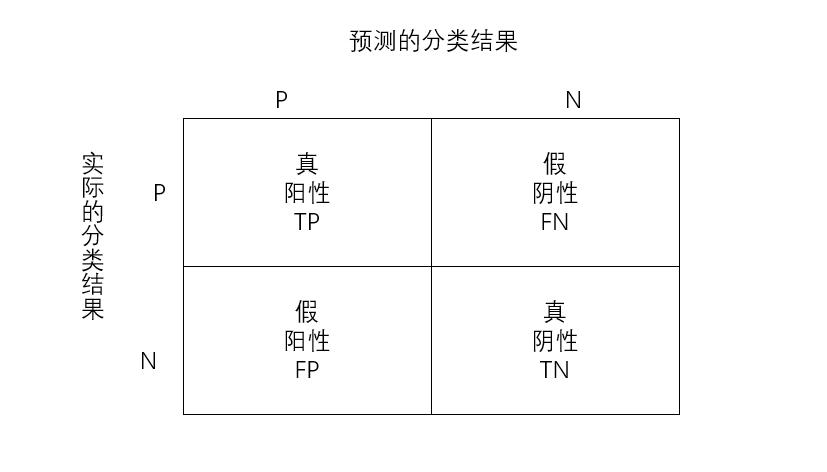

## 2.2 使用sklearn构建完整的分类项目                   

(1) 收集数据集并选择合适的特征：在数据集上我们使用我们比较熟悉的IRIS鸢尾花数据集。
  


```python
import pandas as pd
from sklearn import datasets
iris = datasets.load_iris()
X = iris.data
y = iris.target
feature = iris.feature_names
data = pd.DataFrame(X,columns=feature)
data['target'] = y
data.head()
```


<div>
<style scoped>
    .dataframe tbody tr th:only-of-type {
        vertical-align: middle;
    }

    .dataframe tbody tr th {
        vertical-align: top;
    }

    .dataframe thead th {
        text-align: right;
    }
</style>
<table border="1" class="dataframe">
  <thead>
    <tr style="text-align: right;">
      <th></th>
      <th>sepal length (cm)</th>
      <th>sepal width (cm)</th>
      <th>petal length (cm)</th>
      <th>petal width (cm)</th>
      <th>target</th>
    </tr>
  </thead>
  <tbody>
    <tr>
      <th>0</th>
      <td>5.1</td>
      <td>3.5</td>
      <td>1.4</td>
      <td>0.2</td>
      <td>0</td>
    </tr>
    <tr>
      <th>1</th>
      <td>4.9</td>
      <td>3.0</td>
      <td>1.4</td>
      <td>0.2</td>
      <td>0</td>
    </tr>
    <tr>
      <th>2</th>
      <td>4.7</td>
      <td>3.2</td>
      <td>1.3</td>
      <td>0.2</td>
      <td>0</td>
    </tr>
    <tr>
      <th>3</th>
      <td>4.6</td>
      <td>3.1</td>
      <td>1.5</td>
      <td>0.2</td>
      <td>0</td>
    </tr>
    <tr>
      <th>4</th>
      <td>5.0</td>
      <td>3.6</td>
      <td>1.4</td>
      <td>0.2</td>
      <td>0</td>
    </tr>
  </tbody>
</table>
</div>


各个特征的相关解释：
   - sepal length (cm)：花萼长度(厘米)
   - sepal width (cm)：花萼宽度(厘米)
   - petal length (cm)：花瓣长度(厘米)
   - petal width (cm)：花瓣宽度(厘米)

(2) 选择度量模型性能的指标：                                    
度量分类模型的指标和回归的指标有很大的差异，首先是因为分类问题本身的因变量是离散变量，因此像定义回归的指标那样，单单衡量预测值和因变量的相似度可能行不通。其次，在分类任务中，我们对于每个类别犯错的代价不尽相同，例如：我们将癌症患者错误预测为无癌症和无癌症患者错误预测为癌症患者，在医院和个人的代价都是不同的，前者会使得患者无法得到及时的救治而耽搁了最佳治疗时间甚至付出生命的代价，而后者只需要在后续的治疗过程中继续取证就好了，因此我们很不希望出现前者，当我们发生了前者这样的错误的时候会认为建立的模型是很差的。为了解决这些问题，我们必须将各种情况分开讨论，然后给出评价指标。             
   - 真阳性TP：预测值和真实值都为正例；                        
   - 真阴性TN：预测值与真实值都为正例；                     
   - 假阳性FP：预测值为正，实际值为负；
   - 假阴性FN：预测值为负，实际值为正；                      
                                          
分类模型的指标：                    
   - 准确率：分类正确的样本数占总样本的比例，即：$ACC = \frac{TP+TN}{FP+FN+TP+TN}$.                                
   - 精度：预测为正且分类正确的样本占预测值为正的比例，即：$PRE = \frac{TP}{TP+FP}$.                     
   - 召回率：预测为正且分类正确的样本占类别为正的比例，即：$REC =  \frac{TP}{TP+FN}$.                     
   - F1值：综合衡量精度和召回率，即：$F1 = 2\frac{PRE\times REC}{PRE + REC}$.                                     
   - ROC曲线：以假阳率为横轴，真阳率为纵轴画出来的曲线，曲线下方面积越大越好。                                                          
https://scikit-learn.org/stable/modules/model_evaluation.html#classification-metrics                           
                          
在本次小案例中，我们使用ROC曲线作为最终评价指标。

(3) 选择具体的模型并进行训练                              
   - **逻辑回归logistic regression：**                      
   说到分类问题与回归问题的区别，在于回归问题与分类问题需要预测的因变量不一样。在回归问题中，因变量是连续性变量，我们需要预测$E(Y|X)$是一个连续的实数，但是在分类问题中，我们往往是通过已知X的信息预测Y的类别，往往是一个离散集合中的某个元素。如：是否患癌症，图片是猫还是狗等。一个很自然的想法是能否用线性回归去处理分类问题，答案是可以但不好！先来看看线性回归处理分类问题会出现什么弊端，我们仔细来看这个线性回归的例子，${default = \beta_0 + \beta_1 Balance + \beta_2 Income}$，只要输入Balance 和 Income 以及default的数据就能用最小二乘法估计出${\beta_0,\beta_1}$,设定预测的default>0.5就是违约反之不违约，感觉很完美的样子，但事实真的是这样吗？假设我们需要用某个人的债务(Balance)和收入(Income)去预测是否会信用卡违约(default)：       
      - 我们假设有一个穷人Lisa,他的Balance和Income都很小，那么有可能会导致default的值为负数，那么这个负数代表什么意义呢？显然是没有任何意义的。                
                                  
      - 当我们的分类变量是多类的时候，以0.5为界限划分分类就不可用了，那么我们应该怎么找到一个界限衡量多分类呢？                              
   基于以上问题，现在大家是否还觉得线性回归模型作为一个分类模型是否足够优秀呢？其实，为了解决以上的问题（1）我们来想想能不能将线性回归的结果default转化为区间[0:1]上，让default转变成一个违约的概率呢？下面我们来解决这个问题吧。                              
   在推导逻辑回归之前，我们先来认识下一组函数，这组函数具有神奇的作用，可以将是实数轴上的数转换为[0:1]区间上的概率。
  首先，我们假设我们的线性回归模型为 ${Y=\beta_0+\beta_1 X}$，那么这个函数是如何将线性回归的结果转化为概率呢？这个函数就是logistic 函数，具体的形式为   ${p(X) = \dfrac{e^{\beta_0 + \beta_1X}}{1+e^{\beta_0 + \beta_1X}}}$，他的函数图像如下图：（左边是线性回归，右边是逻辑函数）                             
                                     
  因此，我们假设逻辑回归模型为：$p(y = 1|x) = \frac{1}{1+e^{-w^Tx}}$ .                              
  下面我们来具体推导下逻辑回归模型：                          
  假设数据Data$\{(x_i,y_i) \},\;\;i = 1,2,...,N,\;\;x_i \in R^p,y_i \in \{0,1 \}$，设$p_1 = p(y=1|x) = \sigma(w^T) = \frac{1}{1+e^{-w^Tx}}$。因为y只可能取0或者1，因此假设数据服从0-1分布，也叫伯努力分布，即：当y=1时，$p(y|x)=p_1$，当y=0时，$p(y|x)=1-p_1$，可以写成$p(y|x) = p_1^y(1-p_1)^{1-y}$，可以带入y=0和y=1进去验证，结果和前面的结论一模一样。                    
  我们使用极大似然估计MLE，即：                         
  $$
  \hat{w} = argmax_w\;\;log\;P(Y|X) = argmax_x\;\;log\;\prod_{i=1}^N P(y_i|x_i) = argmax_w \sum\limits_{i=1}^{N} log\;P(y_i|x_i)\\
  \;\;\; = argmax_w \sum\limits_{i=1}^{N}(y_ilog\;p_1 + (1-y_i)log(1-p_1)) \\ 
  记：L(w) = \sum\limits_{i=1}^{N}(y_ilog\;p_1 + (1-y_i)log(1-p_1))\\
 \;\;\; \frac{\partial L}{\partial w_k} = \sum\limits_{i=1}^{N} y_i\frac{1}{p_1}\frac{\partial p_1}{\partial z}\frac{\partial z}{\partial w_k} + (1-y_i)\frac{1}{1-p_1}(-\frac{\partial p_1}{\partial z}\frac{\partial z}{\partial w_k})\\
  \;\;\;=\sum\limits_{i=1}^{N}y_i\frac{1}{\sigma(z)}(\sigma(z_i)-\sigma(z_i)^2)x_i + (1-y_i)\frac{1}{1-\sigma(z_i)}[-(\sigma(z_i)-\sigma(z_i)^2)x_i]\\
  \;\;\; =\sum\limits_{i=1}^{N}[(y_i-y_i\sigma(z_i))x_i + (1-y_i)(-\sigma(z_i))x_i]\\
  \;\;\; = \sum\limits_{i=1}^{N}y_ix_i-\sigma(z_i)x_i = \sum\limits_{i=1}^{N}(y_i-\sigma(z_i))x_i
  $$                 
  因此，$\frac{\partial L}{\partial w_k} = \sum\limits_{i=1}^{N}(y_i-\sigma(z_i))x_i$，由于这里涉及的函数不像线性回归一样能简单求出解析解，因此我们使用迭代的优化算法：梯度下降法，即：                       
  $w_k^{(t+1)}\leftarrow w_k^{(t)} - \eta \sum\limits_{i=1}^{N}(y_i-\sigma(z_i))x_i^{(k)},\;\;\;其中，x_i^{(k)}为第i个样本第k个特征$                                 
  如果想了解关于梯度下降法等无约束算法的具体细节，可以参照笔者写的另外两篇知乎博客：                          
  最优化理论之无约束优化基本结构及其python应用：https://zhuanlan.zhihu.com/p/163405865                                                   
  最优化理论之负梯度方法与Newton型方法：https://zhuanlan.zhihu.com/p/165914126                                              
  对于问题(2),我们值得注意的是，逻辑回归在实际中不太用于多分类问题，因为实际效果不是很好，所以我们可以借助其他模型来解决这个问题，那让我们来解决这个遗留下来的问题吧。                                
 
             

   - 基于概率的分类模型：                               
   (1) 线性判别分析：                                              
   线性判别分析是一个比较久远的算法，我将会从两个方向去描述这个算法，因为我觉得每位读者都有自己喜欢的那个理解的方向，分别是基于贝叶斯公式和降维分类的思想。                        
      - 基于贝叶斯公式对线性判别分析的理解：                       
   在讨论如何解决多分类问题之前，我们先来说说贝叶斯的那些事吧。在概率统计的领域里有一条神奇的公式叫贝叶斯定理，具体的形式是：${P(Y=k|X=x) = \dfrac{{\pi}_kf_k(x)}{\sum\limits_{l=1}^K{\pi}_lf_l(x)}}$ ，我们 先不要被公式的符号吓到，我们先来看看符号具体代表什么意思。我们假设观测有${K}$类，${\pi_k}$为随机选择的观测来自第${k}$类的 __先验概率__，也就是样本里面第${k}$类的样本个数除以总样本的个数：${\pi_k = \dfrac{n_k}{n}}$。再来 ${f_k(x) =P(X=x|Y=k)}$，表示第${k}$类观测的X的密度函数，说的直白一点就是在${Y=k}$的样本里${X=x}$的样本个数，即${f_k(x) = P(X=x|Y=k) = \dfrac{n_{(X=x,Y=k)}}{n_{(Y=k)}}}$，最后，${\sum\limits_{l=1}^K{\pi}_lf_l(x)}=P(X=x)=\dfrac{n_{(X=x)}}{n}$，也就是样本中${X=x}$的概率。
      在讨论贝叶斯定理后，我们回到分类问题，这个定理跟我们的分类问题有什么关联呢？没错，这个公式${P(Y=k|X=x) = \dfrac{{\pi}_kf_k(x)}{\sum\limits_{l=1}^K{\pi}_lf_l(x)}}$给出了给定样本条件下，${Y=k}$这个类别下的概率，这给分类问题提供了一条思路，那就是计算这个${P(Y=k|X=x)}$，而且我们的逻辑回归就是这么干的，但是在${P(Y=k|X=x) = \dfrac{{\pi}_kf_k(x)}{\sum\limits_{l=1}^K{\pi}_lf_l(x)}}$这个公式中，分母${{\sum\limits_{l=1}^K{\pi}_lf_l(x)} = P(X=x)}$当样本给定的时候是一个与分类${k}$无关的常数,所以我们的问题可以简化为只需要计算分子${{\pi}_kf_k(x)}$,进而比较哪个类别的概率最大就知道属于哪个类别了，因此我们的分类思路就出来啦，这个思路不同于逻辑回归，逻辑回归需要计算具体的${P(Y=k|X=x)}$概率值，而我们现在的思路是通过贝叶斯定理计算贝叶斯定理的分子，比较分子最大的那个类别为最终类别。                 
      在我们推导复杂算法之前，我们先推导下简单的当自变量个数只有一个的模型，即${p=1}$的简单模型。我们记${P(Y=k|X=x) = \dfrac{{\pi}_kf_k(x)}{\sum\limits_{l=1}^K{\pi}_lf_l(x)}}$ 的分子为${g_k(x) = {\pi}_kf_k(x)}$。在这里，我们做个模型假设：假设${f_k(x) }$服从正态分布，即${f_k(x) \sim N(\mu,\sigma_k^2)}$，而且每个${\sigma_k^2 = \sigma^2}$，同方差假设。因此${f_k(x) = \dfrac{1}{\sqrt{2\pi}\sigma_k}e^{-\dfrac{1}{2\sigma^2}(x-\mu_k)^2}}$，最终我们的${g_k(x) = \pi_k\dfrac{1}{\sqrt{2\pi}\sigma_k}e^{-\dfrac{1}{2\sigma^2}(x-\mu_k)^2}}$,终于算出来啦。这个式子不是很好计算，我们对${g_k(x)}$取个对数，令${\delta_k(x) = ln(g_k(x))=ln\pi_k+\dfrac{\mu}{\sigma^2}x-\dfrac{\mu^2}{2\sigma^2}}$，到这里我们的模型建立模型，我们只需要把位置的${\mu_k}$与${\sigma^2}$估计出来就好了。${\hat{\mu}_k =\dfrac{1}{n_k}\sum\limits_{i:y_i=k}x_i}$，也就是当${y=k}$这一类中${x}$的平均值；${\hat{\sigma}^2 =\dfrac{1}{n-K}\sum\limits_{k=1}^K\sum\limits_{i:y_i=k}(x_i-\hat{\mu}_k)^2 }$，说白了就是计算每一类的方差，再求平均值。总结下上面的公式就是：                                    
${\begin{cases}\delta_k(x) = ln(g_k(x))=ln\pi_k+\dfrac{\mu}{\sigma^2}x-\dfrac{\mu^2}{2\sigma^2}\\{\hat{\mu}_k =\dfrac{1}{n_k}\sum\limits_{i:y_i=k}x_i}\\{\hat{\sigma}^2 =\dfrac{1}{n-K}\sum\limits_{k=1}^K\sum\limits_{i:y_i=k}(x_i-\hat{\mu}_k)^2}\end{cases}}$                              
      至此，我们的模型就建立完成了，我们只需要代入数据求出${\delta_k(x)}$，哪个${k}$对应的${\delta_k(x)}$大，就是哪一类。                                   
   （下图虚线是线性判别分析的决策边界，正态曲线哪边高样本就是哪一类）                  
                                  
      我们推到出了一个自变量的简单模型，就要泛化为多个自变量的线性判别分析了，即${p>1}$。其实原理一样的，只是将一元正态分布扩展为多元正态分布：
      ${f_k(x)=\dfrac{1}{(2\pi)^{\tfrac{p}{2}}|\Sigma|^\tfrac{1}{2}}e^{[-\tfrac{1}{2}(x-\mu_k)^T\Sigma^{-1}(x-\mu_k)]}}$                           
      ${\hat{\mu_k}=(\mu_{k1},\mu_{k2},......,\mu_{kp})   ,   \hat{\Sigma}=\dfrac{1}{p-1}\sum\limits_{j=1}^p(x_j-\overline{x})(x_j-\overline{x})^T}$                               
      ${\delta_k(x) = ln(\pi_kf_k(x))=ln(\pi_k)-(\dfrac{p}{2}ln(2\pi)+\dfrac{1}{2}ln(|\Sigma|))-\dfrac{1}{2}(x-\mu_k)^T\Sigma^-1(x-\mu_k)=x^T\hat{\Sigma}\hat{\mu}_k-\dfrac{1}                                                       {2}\hat{\mu}_k^T\hat{\Sigma}^{-1}\hat{\mu}_k+ln\hat{\pi}_k}$                            
      - 降维分类的思想理解线性判别分析：                   
      基于数据进行分类时，一个很自然的想法是：将高维的数据降维至一维，然后使用某个阈值将各个类别分开。下面用图的形式展示：                   
                              
      图中，数据的维度是二维的，我们的想法是把数据降维至一维，然后用阈值就能分类。这个似乎是一个很好的想法，我们总是希望降维后的数据同一个类别自身内部方差小，不同类别之间的方差要尽可能大。这也是合理的，因为同一个类别的数据应该更加相似，因此方差小；不同类别的数据之间应该很不相似，这样才能更容易对数据进行分类，我们简称为：**类内方差小，类间方差大**，在计算机语言叫“松耦合，高内聚”。在做具体的推导之前，我们对数据的形式和一些基本统计量做一些描述：                            
      特征$X = (x_1,x_2,...,x_N)^T$，因变量$Y = (y_1,y_2,...,y_N)^T,\;\;其中，y_i \in \{+1,-1 \}$，类别c1的特征$X_{c_1} = \{x_i|y_i=+1 \}$，同理，类别c2的特征$X_{c_2} = \{x_i|y_i=-1 \}$，属于c1类别的数据个数为$N_1$，属于类别c2的数据个数为$N_2$，其中，$N_1+N_2 = N$。                         
      特征X投影在w方向至一维：$z_i = w^Tx_i,\;\;||w|| = 1$                            
      全样本投影的均值$\bar{z} = \frac{1}{N}\sum\limits_{i=1}^{N}z_i = \frac{1}{N}\sum\limits_{i=1}^{N}w^Tx_i$                    
      全样本投影的协方差$S_z = \frac{1}{N}\sum\limits_{i=1}^{N}(z_i-\bar{z})(z_i-\bar{z})^T = \frac{1}{N}\sum\limits_{i=1}^{N}(w^Tx_i-\bar{z})(w^Tx_i-\bar{z})^T$                   
      c1样本投影的均值$\bar{z_1} = \frac{1}{N_1}\sum\limits_{i=1}^{N_1}z_i = \frac{1}{N_1}\sum\limits_{i=1}^{N_1}w^Tx_i$                    
      c1样本投影的协方差$S_{z_1} = \frac{1}{N_1}\sum\limits_{i=1}^{N_1}(z_i-\bar{z_1})(z_i-\bar{z_1})^T = \frac{1}{N_1}\sum\limits_{i=1}^{N_1}(w^Tx_i-\bar{z_1})(w^Tx_i-\bar{z_1})^T$                       
      c2样本投影的均值 $\bar{z_2} = \frac{1}{N_2}\sum\limits_{i=1}^{N_2}z_i = \frac{1}{N_2}\sum\limits_{i=1}^{N_2}w^Tx_i$                     
      c2样本投影的协方差$S_{z_2} = \frac{1}{N_2}\sum\limits_{i=1}^{N_2}(z_i-\bar{z_2})(z_i-\bar{z_2})^T = \frac{1}{N_2}\sum\limits_{i=1}^{N_2}(w^Tx_i-\bar{z_2})(w^Tx_i-\bar{z_2})^T$                      
      类间差距：$(\bar{z}_1-\bar{z}_2)^2$                      
      类内方差：$S_1 + S_2$                          
      由于线性判别分析的目标是同一类别内方差小，不同类别之间距离大，因此损失函数定义为：   
                            
   $$
      J(w) = \frac{(\bar{z}_1-\bar{z}_2)^2}{s_1+s_2} = \frac{w^T(\bar{x}_{c_1}-\bar{x}_{c_2})(\bar{x}_{c_1}-\bar{x}_{c_2})^Tw}{w^T(s_{c_1}+s_{c_2})w}\\
      \;\;\; \hat{w} = argmax_w\;J(w)
   $$                             
   记：$S_b = (\bar{x}_{c_1}-\bar{x}_{c_2})(\bar{x}_{c_1}-\bar{x}_{c_2})^T,\;S_w = (s_{c_1}+s_{c_2})$，因此$J(w) = \frac{w^TS_bw}{w^TS_ww}$                   
   让J(w)对w求导等于0，求出：$w = S_w^{-1}(\bar{x}_{c_1}-\bar{x}_{c_2})$                       
   (2) 朴素贝叶斯：                                        
   在线性判别分析中，我们假设每种分类类别下的特征遵循同一个协方差矩阵，每两个特征之间是存在协方差的，因此在线性判别分析中各种特征是不是独立的。但是，朴素贝叶斯算法对线性判别分析作进一步的模型简化，它将线性判别分析中的协方差矩阵中的协方差全部变成0，只保留各自特征的方差，也就是朴素贝叶斯假设各个特征之间是不相关的。在之前所看到的偏差-方差理论中，我们知道模型的简化可以带来方差的减少但是增加偏差，因此朴素贝叶斯也不例外，它比线性判别分析模型的方差小，偏差大。虽然简化了模型，实际中使用朴素贝叶斯的案例非常多，甚至多于线性判别分析，例如鼎鼎大名的新闻分类，垃圾邮件分类等。
   


```python
#  逻辑回归
'''
penalty       {‘l1’, ‘l2’, ‘elasticnet’, ‘none’}, default=’l2’正则化方式
dual      bool, default=False   是否使用对偶形式，当n_samples> n_features时，默认dual = False。   
C        float, default=1.0      
solver       {‘newton-cg’, ‘lbfgs’, ‘liblinear’, ‘sag’, ‘saga’}, default=’lbfgs’     
l1_ratio         float, default=None           
'''
from sklearn.linear_model import LogisticRegression
log_iris = LogisticRegression()
log_iris.fit(X,y)
log_iris.score(X,y)
```

    C:\ProgramData\Anaconda3\lib\site-packages\sklearn\linear_model\_logistic.py:762: ConvergenceWarning: lbfgs failed to converge (status=1):
    STOP: TOTAL NO. of ITERATIONS REACHED LIMIT.
    
    Increase the number of iterations (max_iter) or scale the data as shown in:
        https://scikit-learn.org/stable/modules/preprocessing.html
    Please also refer to the documentation for alternative solver options:
        https://scikit-learn.org/stable/modules/linear_model.html#logistic-regression
      n_iter_i = _check_optimize_result(
    


    0.9733333333333334


```python
# 线性判别分析
'''
参数：
solver:{'svd'，'lsqr'，'eigen'}，默认='svd'
solver的使用，可能的值：
'svd'：奇异值分解（默认）。不计算协方差矩阵，因此建议将此求解器用于具有大量特征的数据。

'lsqr'：最小二乘解，可以与收缩结合使用。

'eigen'：特征值分解，可以与收缩结合使用。
'''
from sklearn.discriminant_analysis import LinearDiscriminantAnalysis
lda_iris = LinearDiscriminantAnalysis()
lda_iris.fit(X,y)
lda_iris.score(X,y)
   
```


    0.98


```python
# 朴素贝叶斯             
from sklearn.naive_bayes import GaussianNB
NB_iris = GaussianNB()
NB_iris.fit(X, y)
NB_iris.score(X,y)
```


    0.96


   - 决策树 ：                     
   与前面内容所讲的决策树回归大致是一样的，只是在回归问题中，选择分割点的标准是均方误差，但是在分类问题中，由于因变量是类别变量而不是连续变量，因此用均方误差显然不合适。那问题是用什么作为选择分割点的标准呢？我们先来分析具体的问题：                         
   在回归树中，对一个给定的观测值，因变量的预测值取它所属的终端结点内训练集的平均因变量。与之相对应，对于分类树来说，给定一个观测值，因变量的预测值为它所属的终端结点内训练集的**最常出现的类**。分类树的构造过程与回归树也很类似，与回归树一样，分类树也是采用递归二叉分裂。但是在分类树中，均方误差无法作为确定分裂节点的准则，一个很自然的替代指标是分类错误率。分类错误率就是：此区域内的训练集中非常见类所占的类别，即：                                   
   $$
   E = 1-max_k(\hat{p}_{mk})
   $$                       
   上式中的$\hat{p}_{mk}$代表第m个区域的训练集中第k类所占的比例。但是在大量的事实证明：分类错误率在构建决策树时不够敏感，一般在实际中用如下两个指标代替：             
   (1) 基尼系数：                   
   $$
   G = \sum\limits_{k=1}^{K} \hat{p}_{mk}(1-\hat{p}_{mk})
   $$             
   在基尼系数的定义中，我们发现这个指标衡量的是K个类别的总方差。不难发现，如果所有的$\hat{p}_{mk}$的取值都接近0或者1，基尼系数会很小。因此基尼系数被视为衡量结点纯度的指标----如果他的取值小，那就意味着某个节点包含的观测值几乎来自同一个类别。                         
   由基尼系数作为指标得到的分类树叫做：CART。                        
   (2) 交叉熵：                       
   可以替代基尼系数的指标是交叉熵，定义如下：                           
   $$
   D = -\sum\limits_{k=1}^{K} \hat{p}_{mk}log\;\hat{p}_{mk}
   $$                     
   显然，如果所有的$\hat{p}_{mk}$都接近于0或者1，那么交叉熵就会接近0。因此，和基尼系数一样，如果第m个结点的纯度越高，则交叉熵越小。事实证明，基尼系数和交叉熵在数值上时很接近的。                   
   
                                               
   决策树分类算法的完整步骤：                          
      a.  选择最优切分特征j以及该特征上的最优点s：                
      遍历特征j以及固定j后遍历切分点s，选择使得基尼系数或者交叉熵最小的(j,s)                                                   
       b. 按照(j,s)分裂特征空间，每个区域内的类别为该区域内样本比例最多的类别。                           
       c. 继续调用步骤1，2直到满足停止条件，就是每个区域的样本数小于等于5。        
       d. 将特征空间划分为J个不同的区域，生成分类树。                 
   


```python
# 使用决策树算法对iris分类：
'''
criterion:{“gini”, “entropy”}, default=”gini”
max_depth:树的最大深度。
min_samples_split:拆分内部节点所需的最少样本数
min_samples_leaf :在叶节点处需要的最小样本数。

'''
from sklearn.tree import DecisionTreeClassifier
tree_iris = DecisionTreeClassifier(min_samples_leaf=5)
tree_iris.fit(X,y)
tree_iris.score(X,y)
```


    0.9733333333333334


   - 支持向量机SVM：                                   
   支持向量机SVM是20世纪90年代在计算机界发展起来的一种分类算法，在许多问题中都被证明有较好的效果，被认为是适应性最广的算法之一。                         
                                  
   支持向量机的基本原理非常简单，如图所视，白色和蓝色的点各为一类，我们的目标是找到一个分割平面将两个类别分开。通常来说，如果数据本身是线性可分的，那么事实上存在无数个这样的超平面。这是因为给定一个分割平面稍微上移下移或旋转这个超平面，只要不接触这些观测点，仍然可以将数据分开。一个很自然的想法就是找到**最大间隔超平面**，即找到一个分割平面距离最近的观测点最远。下面我们来严格推导：                   
   我们根据距离超平米那最近的点，只要同时缩放w和b可以得到：$w^Tx_1 + b = 1$与$w^Tx_2+b = -1$，因此：                      
   $$
  \begin{array}{l}
   w^{T} x_{1}+b=1 \\
    w^{T} x_{2}+b=-1 \\
    \left(w^{T} x_{1}+b\right)-\left(w^{T} x_{2}+b\right)=2 \\
   w^{T}\left(x_{1}-x_{2}\right)=2 \\
   \qquad \begin{array}{l}
   w^{T}\left(x_{1}-x_{2}\right)=\|w\|_{2}\left\|x_{1}-x_{2}\right\|_{2} \cos \theta=2 \\
   \left\|x_{1}-x_{2}\right\|_{2} \cos \theta=\frac{2}{\|w\|_{2}}
   \end{array} \\
    \qquad \begin{array}{l}
   d_{1}=d_{2}=\frac{\left\|x_{1}-x_{2}\right\|_{2} \cos \theta}{2}=\frac{\frac{2}{\|w\|_{2}}}{2}=\frac{1}{\|w\|_{2}} \\
   d_{1}+d_{2}=\frac{2}{\|w\|_{2}}
   \end{array}
   \end{array}
   $$                        
   由此可知道SVM模型的具体形式：                           
   $$
  \begin{aligned}
\min _{w, b} & \frac{1}{2}\|w\|^{2} \\
\text { s.t. } & y^{(i)}\left(w^{T} x^{(i)}+b\right) \geq 1, \quad i=1, \ldots, n
\end{aligned}
   $$                     
   可以将约束条件写为: $g_{i}(w)=-y^{(i)}\left(w^{T} x^{(i)}+b\right)+1 \leq 0  $                                                     
   可以将优化问题拉格朗日化
   $$
   \mathcal{L}(w, b, \alpha)=\frac{1}{2}\|w\|^{2}-\sum_{i=1}^{n} \alpha_{i}\left[y^{(i)}\left(w^{T} x^{(i)}+b\right)-1\right]
   $$                        
   因此：                   
   $$
   \mathcal{L}(w, b, \alpha)=\frac{1}{2}\|w\|^{2}-\sum_{i=1}^{n} \alpha_{i}\left[y^{(i)}\left(w^{T} x^{(i)}+b\right)-1\right]
   $$                   
   欲构造 dual 问题, 首先求拉格朗日化的问题中  $\mathrm{w} $ 和  $\mathrm{b} $ 的值, 对 $ \mathrm{w}$  求梯度, 令梯度为  0,  可求得 w:              
   对 b 求梯度, 令梯度为 0, 可得：              
   $$
   \frac{\partial}{\partial b} \mathcal{L}(w, b, \alpha)=\sum_{i=1}^{n} \alpha_{i} y^{(i)}=0
   $$               

   将  $\mathrm{w}$  带入拉格朗日化的原问题可得                        
   $$
   \begin{array}{l}
   \mathcal{L}(w, b, \alpha)=\sum_{i=1}^{n} \alpha_{i}-\frac{1}{2} \sum_{i, j=1}^{n} y^{(i)} y^{(j)} \alpha_{i} \alpha_{j}\left(x^{(i)}\right)^{T} x^{(j)}-b \sum_{i=1}^{n} \alpha_{i} y^{(i)} \\
   \mathcal{L}(w, b, \alpha)=\sum_{i=1}^{n} \alpha_{i}-\frac{1}{2} \sum_{i, j=1}^{n} y^{(i)} y^{(j)} \alpha_{i} \alpha_{j}\left(x^{(i)}\right)^{T} x^{(j)}
   \end{array}
   $$                           
   因此：                           
   $$
   \begin{aligned}
    &\text { 对拉格朗日化的原问题求最小值, 得到了 } \mathrm{w} \text { , 现在可以构造 dual 问題 }\\
    &\begin{aligned}
    \max _{\alpha} & W(\alpha)=\sum_{i=1}^{n} \alpha_{i}-\frac{1}{2} \sum_{i, j=1}^{n} y^{(i)} y^{(j)} \alpha_{i} \alpha_{j}\left\langle x^{(i)}, x^{(j)}\right\rangle \\
    \text { s.t. } & \alpha_{i} \geq 0, \quad i=1, \ldots, n \\
    & \sum_{i=1}^{n} \alpha_{i} y^{(i)}=0
    \end{aligned}\\
    &\text { 可以推导出 b的值为: } b^{*}=-\frac{\max _{i: y^{(i)}=-1} w^{* T} x^{(i)}+\min _{i: y^{(i)}=1} w^{* T} x^{(i)}}{2}\\
    &\begin{array}{r}
    \text { SVM的决策子如下,值的符号为类别. } \\
    \qquad w^{T} x+b=\left(\sum_{i=1}^{n} \alpha_{i} y^{(i)} x^{(i)}\right)^{T} x+b=\sum_{i=1}^{n} \alpha_{i} y^{(i)}\left\langle x^{(i)}, x\right\rangle+b
    \end{array}
    \end{aligned}
    $$                              
    

   - 非线性支持向量机：                     
   在刚刚的讨论中，我们都是着重讨论了线性支持向量机是如何工作的，但是在现实生活中，我们很难碰到线性可分的数据集，如：             
                            
   那我们应该如何处理非线性问题呢？答案就是将数据投影至更加高的维度！                    
                        
   上图中，在一维数据做不到线性可分，我们将数据投影至二维平面就可以成功线性可分。那么，我们来详细探讨下这其中的奥妙：                        
   
   $$
   \begin{array}{l}
   \Phi: \mathcal{X} \mapsto \hat{\mathcal{X}}=\Phi(\mathbf{x}) \\
   \Phi\left(\left[x_{i 1}, x_{i 2}\right]\right)=\left[x_{i 1}, x_{i 2}, x_{i 1} x_{i 2}, x_{i 1}^{2}, x_{i 2}^{2}\right]
   \end{array}
   $$                      
   如果我们使用上面公式的形式将低维数据拓展至高维数据，则必须面临一个很大的问题，那就是：维度爆炸导致的计算量太大的问题。假如是一个2维特征的数据，我们可以将其映射到5维来做特征的内积，如果原始空间是三维，可以映射到到19维空间，似乎还可以处理。但是如果我们的低维特征是100个维度，1000个维度呢？那么我们要将其映射到超级高的维度来计算特征的内积。这时候映射成的高维维度是爆炸性增长的，这个计算量实在是太大了，而且如果遇到无穷维的情况，就根本无从计算了。能不能呢个避免这个问题呢？核函数隆重登场：                       
   回顾线性可分SVM的优化目标函数：                  
   $$
   \underbrace{ min }_{\alpha}  \frac{1}{2}\sum\limits_{i=1,j=1}^{m}\alpha_i\alpha_jy_iy_jx_i \bullet x_j - \sum\limits_{i=1}^{m}\alpha_i\\
   s.t. \; \sum\limits_{i=1}^{m}\alpha_iy_i = 0\\
   0 \leq \alpha_i \leq C
   $$                  
   注意到上式低维特征仅仅以内积$x_i \bullet x_j$ 的形式出现，如果我们定义一个低维特征空间到高维特征空间的映射$\phi$，将所有特征映射到一个更高的维度，让数据线性可分，我们就可以继续按前两篇的方法来优化目标函数，求出分离超平面和分类决策函数了。也就是说现在的SVM的优化目标函数变成：                         
   $$
   \begin{array}{c}
   \underbrace{\min }_{\alpha} \frac{1}{2} \sum_{i=1, j=1}^{m} \alpha_{i} \alpha_{j} y_{i} y_{j} \phi\left(x_{i}\right) \bullet \phi\left(x_{j}\right)-\sum_{i=1}^{m} \alpha_{i} \\
   \text { s. } t . \sum_{i=1}^{m} \alpha_{i} y_{i}=0 \\
   0 \leq \alpha_{i} \leq C
   \end{array}
   $$                    
   可以看到，和线性可分SVM的优化目标函数的区别仅仅是将内积$x_i \bullet x_j$替换为$\phi(x_i) \bullet \phi(x_j)$。我们要将其映射到超级高的维度来计算特征的内积。这时候映射成的高维维度是爆炸性增长的，这个计算量实在是太大了，而且如果遇到无穷维的情况，就根本无从计算了。下面引入核函数：               
   假设$\phi$是一个从低维的输入空间$\chi$（欧式空间的子集或者离散集合）到高维的希尔伯特空间的$\mathcal{H}$映射。那么如果存在函数$K(x,z)$，对于任意$x, z \in \chi$，都有：                    
   $$
   K(x, z) = \phi(x) \bullet \phi(z)
   $$                       
   那么我们就称$K(x, z)$为核函数。                   
   仔细发现，$K(x, z)$的计算是在低维特征空间来计算的，它避免了在刚才我们提到了在高维维度空间计算内积的恐怖计算量。也就是说，我们可以好好享受在高维特征空间线性可分的利益，却避免了高维特征空间恐怖的内积计算量。下面介绍几种常用的核函数：                     
   (1)  多项式核函数：                   
   多项式核函数（Polynomial Kernel）是线性不可分SVM常用的核函数之一，表达式为：                         
   $$
   K\left(\mathbf{x}_{i}, \mathbf{x}_{j}\right)=\left(\left\langle\mathbf{x}_{i}, \mathbf{x}_{j}\right\rangle+c\right)^{d}
   $$             
   C用来控制低阶项的强度，C=0,d=1代表无核函数。                       
   (2) 高斯核函数：                                                   
   高斯核函数（Gaussian Kernel），在SVM中也称为径向基核函数（Radial Basis Function,RBF），它是非线性分类SVM最主流的核函数。libsvm默认的核函数就是它。表达式为：                             
   $$
   K\left(\mathbf{x}_{i}, \mathbf{x}_{j}\right)=\exp \left(-\frac{\left\|\mathbf{x}_{i}-\mathbf{x}_{j}\right\|_{2}^{2}}{2 \sigma^{2}}\right)
   $$                              
   使用高斯核函数之前需要将特征标准化，因此这里衡量的是样本之间的相似度。                    
   (3) Sigmoid核函数：                    
   Sigmoid核函数（Sigmoid Kernel）也是线性不可分SVM常用的核函数之一，表达式为：               
   $$
   K\left(\mathbf{x}_{i}, \mathbf{x}_{j}\right)=\tanh \left(\alpha \mathbf{x}_{i}^{\top} \mathbf{x}_{j}+c\right)
   $$                        
   此时的SVM相当于没有隐藏层的简单神经网络。                     
   (4) 余弦相似度核：                  
   常用于衡量两段文字的余弦相似度，表达式为：                    
   $$
   K\left(\mathbf{x}_{i}, \mathbf{x}_{j}\right)=\frac{\mathbf{x}_{i}^{\top} \mathbf{x}_{j}}{\left\|\mathbf{x}_{i}\right\|\left\|\mathbf{x}_{j}\right\|}
   $$
   


```python
from sklearn.pipeline import make_pipeline
from sklearn.preprocessing import StandardScaler
from sklearn.svm import SVC
'''
C:正则化参数。正则化的强度与C成反比。必须严格为正。惩罚是平方的l2惩罚。
kernel:{'linear'，'poly'，'rbf'，'sigmoid'，'precomputed'}，默认='rbf'
degree:多项式和的阶数
gamma:“ rbf”，“ poly”和“ Sigmoid”的内核系数。
shrinking:是否软间隔分类，默认true

'''
svc_iris = make_pipeline(StandardScaler(), SVC(gamma='auto'))
svc_iris.fit(X, y)
svc_iris.score(X,y)
```


    0.9733333333333334


```python

```
