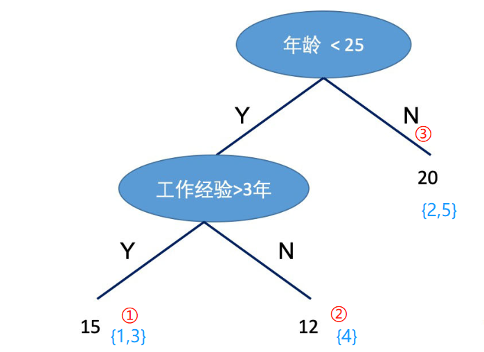
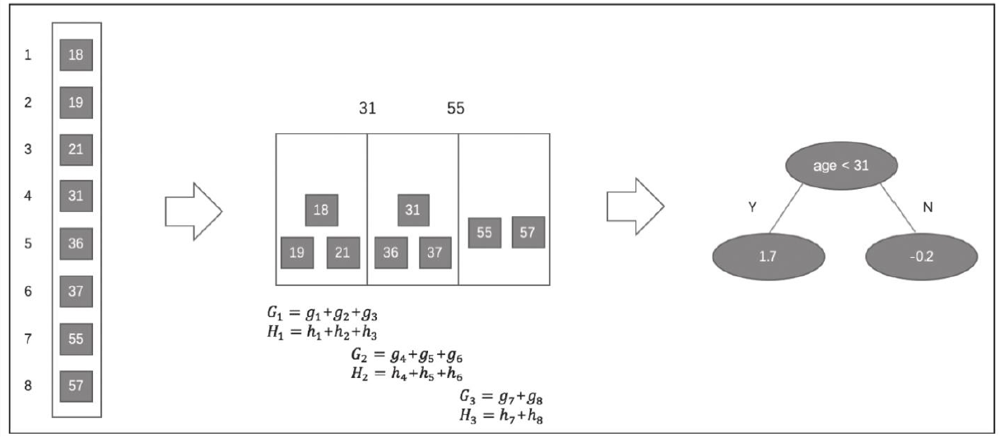

参考：[DataWhale教程链接](https://github.com/datawhalechina/team-learning-data-mining/tree/master/EnsembleLearning)

集成学习（上）所有Task：

[（一）集成学习上——机器学习三大任务](https://blog.csdn.net/youyoufengyuhan/article/details/114853640)

[（二）集成学习上——回归模型](https://blog.csdn.net/youyoufengyuhan/article/details/114994155)

[（三）集成学习上——偏差与方差](https://blog.csdn.net/youyoufengyuhan/article/details/115080030)

[（四）集成学习上——回归模型评估与超参数调优](https://blog.csdn.net/youyoufengyuhan/article/details/115136244)

[（五）集成学习上——分类模型](https://blog.csdn.net/youyoufengyuhan/article/details/115271877)

[（六）集成学习上——分类模型评估与超参数调优](https://blog.csdn.net/youyoufengyuhan/article/details/115282143)

[（七）集成学习中——投票法](https://blog.csdn.net/youyoufengyuhan/article/details/115706397)

[（八）集成学习中——bagging](https://blog.csdn.net/youyoufengyuhan/article/details/115710507)

[（九）集成学习中——Boosting简介&AdaBoost](https://blog.csdn.net/youyoufengyuhan/article/details/115919031)

[（十）集成学习中——GBDT](https://blog.csdn.net/youyoufengyuhan/article/details/115956788)

（十一）集成学习中——XgBoost、LightGBM


[TOC]

## 6. XGBoost算法

XGBoost是陈天奇等人开发的一个开源机器学习项目，高效地实现了GBDT算法并进行了算法和工程上的许多改进，被广泛应用在Kaggle竞赛及其他许多机器学习竞赛中并取得了不错的成绩。XGBoost本质上还是一个GBDT，但是力争把速度和效率发挥到极致，所以叫X (Extreme) GBoosted，包括前面说过，两者都是boosting方法。XGBoost是一个优化的分布式梯度增强库，旨在实现高效，灵活和便携。 它在Gradient Boosting框架下实现机器学习算法。 XGBoost提供了并行树提升（也称为GBDT，GBM），可以快速准确地解决许多数据科学问题。 相同的代码在主要的分布式环境（Hadoop，SGE，MPI）上运行，并且可以解决超过数十亿个样例的问题。XGBoost利用了核外计算并且能够使数据科学家在一个主机上处理数亿的样本数据。最终，将这些技术进行结合来做一个端到端的系统以最少的集群系统来扩展到更大的数据集上。Xgboost以CART决策树为子模型，通过Gradient Tree Boosting实现多棵CART树的集成学习，得到最终模型。下面我们来看看XGBoost的最终模型构建：                                    
引用陈天奇的论文，我们的数据为：$\mathcal{D}=\left\{\left(\mathbf{x}_{i}, y_{i}\right)\right\}\left(|\mathcal{D}|=n, \mathbf{x}_{i} \in \mathbb{R}^{m}, y_{i} \in \mathbb{R}\right)$                                        
(1) 构造目标函数：                                 
假设有K棵树，则第i个样本的输出为$\hat{y}_{i}=\phi\left(\mathrm{x}_{i}\right)=\sum_{k=1}^{K} f_{k}\left(\mathrm{x}_{i}\right), \quad f_{k} \in \mathcal{F}$，其中，$\mathcal{F}=\left\{f(\mathbf{x})=w_{q(\mathbf{x})}\right\}\left(q: \mathbb{R}^{m} \rightarrow T, w \in \mathbb{R}^{T}\right)$                           
因此，目标函数的构建为：                                
$$
\mathcal{L}(\phi)=\sum_{i} l\left(\hat{y}_{i}, y_{i}\right)+\sum_{k} \Omega\left(f_{k}\right)
$$
其中，$\sum_{i} l\left(\hat{y}_{i}, y_{i}\right)$为loss function，$\sum_{k} \Omega\left(f_{k}\right)$为正则化项。                   
(2) 叠加式的训练(Additive Training)：                                      
给定样本$x_i$，$\hat{y}_i^{(0)} = 0$(初始预测)，$\hat{y}_i^{(1)} = \hat{y}_i^{(0)} + f_1(x_i)$，$\hat{y}_i^{(2)} = \hat{y}_i^{(0)} + f_1(x_i) + f_2(x_i) = \hat{y}_i^{(1)} + f_2(x_i)$.......以此类推，可以得到：$ \hat{y}_i^{(K)} = \hat{y}_i^{(K-1)} + f_K(x_i)$  ，其中，$ \hat{y}_i^{(K-1)} $ 为前K-1棵树的预测结果，$ f_K(x_i)$ 为第K棵树的预测结果。                                 
因此，目标函数可以分解为：                                        
$$
\mathcal{L}^{(K)}=\sum_{i=1}^{n} l\left(y_{i}, \hat{y}_{i}^{(K-1)}+f_{K}\left(\mathrm{x}_{i}\right)\right)+\sum_{k} \Omega\left(f_{k}\right)
$$
由于正则化项也可以分解为前K-1棵树的复杂度加第K棵树的复杂度，因此：$\mathcal{L}^{(K)}=\sum_{i=1}^{n} l\left(y_{i}, \hat{y}_{i}^{(K-1)}+f_{K}\left(\mathrm{x}_{i}\right)\right)+\sum_{k=1} ^{K-1}\Omega\left(f_{k}\right)+\Omega\left(f_{K}\right)$，由于$\sum_{k=1} ^{K-1}\Omega\left(f_{k}\right)$在模型构建到第K棵树的时候已经固定，无法改变，因此是一个已知的常数，可以在最优化的时候省去，故：                     
$$
\mathcal{L}^{(K)}=\sum_{i=1}^{n} l\left(y_{i}, \hat{y}_{i}^{(K-1)}+f_{K}\left(\mathrm{x}_{i}\right)\right)+\Omega\left(f_{K}\right)
$$
(3) 使用泰勒级数**近似**目标函数：                                      
$$
\mathcal{L}^{(K)} \simeq \sum_{i=1}^{n}\left[l\left(y_{i}, \hat{y}^{(K-1)}\right)+g_{i} f_{K}\left(\mathrm{x}_{i}\right)+\frac{1}{2} h_{i} f_{K}^{2}\left(\mathrm{x}_{i}\right)\right]+\Omega\left(f_{K}\right)
$$
其中，$g_{i}=\partial_{\hat{y}(t-1)} l\left(y_{i}, \hat{y}^{(t-1)}\right)$和$h_{i}=\partial_{\hat{y}^{(t-1)}}^{2} l\left(y_{i}, \hat{y}^{(t-1)}\right)$                                                         
在这里，我们补充下泰勒级数的相关知识：                                 
在数学中，泰勒级数（英语：Taylor series）用无限项连加式——级数来表示一个函数，这些相加的项由函数在某一点的导数求得。具体的形式如下：                          
$$
f(x)=\frac{f\left(x_{0}\right)}{0 !}+\frac{f^{\prime}\left(x_{0}\right)}{1 !}\left(x-x_{0}\right)+\frac{f^{\prime \prime}\left(x_{0}\right)}{2 !}\left(x-x_{0}\right)^{2}+\ldots+\frac{f^{(n)}\left(x_{0}\right)}{n !}\left(x-x_{0}\right)^{n}+......
$$
由于$\sum_{i=1}^{n}l\left(y_{i}, \hat{y}^{(K-1)}\right)$在模型构建到第K棵树的时候已经固定，无法改变，因此是一个已知的常数，可以在最优化的时候省去，故：                               
$$
\tilde{\mathcal{L}}^{(K)}=\sum_{i=1}^{n}\left[g_{i} f_{K}\left(\mathbf{x}_{i}\right)+\frac{1}{2} h_{i} f_{K}^{2}\left(\mathbf{x}_{i}\right)\right]+\Omega\left(f_{K}\right)
$$
(4) 如何定义一棵树：                                           
为了说明如何定义一棵树的问题，我们需要定义几个概念：第一个概念是样本所在的节点位置$q(x)$，第二个概念是有哪些样本落在节点j上$I_{j}=\left\{i \mid q\left(\mathbf{x}_{i}\right)=j\right\}$，第三个概念是每个结点的预测值$w_{q(x)}$，第四个概念是模型复杂度$\Omega\left(f_{K}\right)$，它可以由叶子节点的个数以及节点函数值来构建，则：$\Omega\left(f_{K}\right) = \gamma T+\frac{1}{2} \lambda \sum_{j=1}^{T} w_{j}^{2}$。如下图的例子：                                              
                                        
$q(x_1) = 1,q(x_2) = 3,q(x_3) = 1,q(x_4) = 2,q(x_5) = 3$，$I_1 = \{1,3\},I_2 = \{4\},I_3 = \{2,5\}$，$w = (15,12,20)$                                      
因此，目标函数用以上符号替代后：                                      
$$
\begin{aligned}
\tilde{\mathcal{L}}^{(K)} &=\sum_{i=1}^{n}\left[g_{i} f_{K}\left(\mathrm{x}_{i}\right)+\frac{1}{2} h_{i} f_{K}^{2}\left(\mathrm{x}_{i}\right)\right]+\gamma T+\frac{1}{2} \lambda \sum_{j=1}^{T} w_{j}^{2} \\
&=\sum_{j=1}^{T}\left[\left(\sum_{i \in I_{j}} g_{i}\right) w_{j}+\frac{1}{2}\left(\sum_{i \in I_{j}} h_{i}+\lambda\right) w_{j}^{2}\right]+\gamma T
\end{aligned}
$$
由于我们的目标就是最小化目标函数，现在的目标函数化简为一个关于w的二次函数：$\tilde{\mathcal{L}}^{(K)}=\sum_{j=1}^{T}\left[\left(\sum_{i \in I_{j}} g_{i}\right) w_{j}+\frac{1}{2}\left(\sum_{i \in I_{j}} h_{i}+\lambda\right) w_{j}^{2}\right]+\gamma T$，根据二次函数求极值的公式：$y=ax^2 bx c$求极值，对称轴在$x=-\frac{b}{2 a}$，极值为$y=\frac{4 a c-b^{2}}{4 a}$，因此：                                       
$$
w_{j}^{*}=-\frac{\sum_{i \in I_{j}} g_{i}}{\sum_{i \in I_{j}} h_{i}+\lambda}
$$
以及
$$
\tilde{\mathcal{L}}^{(K)}(q)=-\frac{1}{2} \sum_{j=1}^{T} \frac{\left(\sum_{i \in I_{j}} g_{i}\right)^{2}}{\sum_{i \in I_{j}} h_{i}+\lambda}+\gamma T
$$
(5) 如何寻找树的形状：                           
不难发现，刚刚的讨论都是基于树的形状已经确定了计算$w$和$L$，但是实际上我们需要像学习决策树一样找到树的形状。因此，我们借助决策树学习的方式，使用目标函数的变化来作为分裂节点的标准。我们使用一个例子来说明：                               
                                    
例子中有8个样本，分裂方式如下，因此:                                    
$$
\tilde{\mathcal{L}}^{(old)} = -\frac{1}{2}[\frac{(g_7 + g_8)^2}{H_7+H_8 + \lambda} + \frac{(g_1 +...+ g_6)^2}{H_1+...+H_6 + \lambda}] + 2\gamma \\
\tilde{\mathcal{L}}^{(new)} = -\frac{1}{2}[\frac{(g_7 + g_8)^2}{H_7+H_8 + \lambda} + \frac{(g_1 +...+ g_3)^2}{H_1+...+H_3 + \lambda} + \frac{(g_4 +...+ g_6)^2}{H_4+...+H_6 + \lambda}] + 3\gamma\\
\tilde{\mathcal{L}}^{(old)} - \tilde{\mathcal{L}}^{(new)} = \frac{1}{2}[ \frac{(g_1 +...+ g_3)^2}{H_1+...+H_3 + \lambda} + \frac{(g_4 +...+ g_6)^2}{H_4+...+H_6 + \lambda} - \frac{(g_1+...+g_6)^2}{h_1+...+h_6+\lambda}] - \gamma
$$
因此，从上面的例子看出：分割节点的标准为$max\{\tilde{\mathcal{L}}^{(old)} - \tilde{\mathcal{L}}^{(new)} \}$，即：                               
$$
\mathcal{L}_{\text {split }}=\frac{1}{2}\left[\frac{\left(\sum_{i \in I_{L}} g_{i}\right)^{2}}{\sum_{i \in I_{L}} h_{i}+\lambda}+\frac{\left(\sum_{i \in I_{R}} g_{i}\right)^{2}}{\sum_{i \in I_{R}} h_{i}+\lambda}-\frac{\left(\sum_{i \in I} g_{i}\right)^{2}}{\sum_{i \in I} h_{i}+\lambda}\right]-\gamma
$$
(6.1) 精确贪心分裂算法：                           
XGBoost在生成新树的过程中，最基本的操作是节点分裂。节点分裂中最重 要的环节是找到最优特征及最优切分点, 然后将叶子节点按照最优特征和最优切 分点进行分裂。选取最优特征和最优切分点的一种思路如下：首先找到所有的候 选特征及所有的候选切分点, 一一求得其 $\mathcal{L}_{\text {split }}$, 然后选择$\mathcal{L}_{\mathrm{split}}$ 最大的特征及 对应切分点作为最优特征和最优切分点。我们称此种方法为精确贪心算法。该算法是一种启发式算法, 因为在节点分裂时只选择当前最优的分裂策略, 而非全局最优的分裂策略。精确贪心算法的计算过程如下所示：                                    

                                             

(6.2) 基于直方图的近似算法：                                                
精确贪心算法在选择最优特征和最优切分点时是一种十分有效的方法。它计算了所有特征、所有切分点的收益, 并从中选择了最优的, 从而保证模型能比较好地拟合了训练数据。但是当数据不能完全加载到内存时，精确贪心算法会变得 非常低效，算法在计算过程中需要不断在内存与磁盘之间进行数据交换，这是个非常耗时的过程, 并且在分布式环境中面临同样的问题。为了能够更高效地选 择最优特征及切分点, XGBoost提出一种近似算法来解决该问题。 基于直方图的近似算法的主要思想是：对某一特征寻找最优切分点时，首先对该特征的所有切分点按分位数 (如百分位) 分桶, 得到一个候选切分点集。特征的每一个切分点都可以分到对应的分桶; 然后，对每个桶计算特征统计G和H得到直方图, G为该桶内所有样本一阶特征统计g之和, H为该桶内所有样本二阶特征统计h之和; 最后，选择所有候选特征及候选切分点中对应桶的特征统计收益最大的作为最优特征及最优切分点。基于直方图的近似算法的计算过程如下所示：                                   
1) 对于每个特征 $k=1,2, \cdots, m,$ 按分位数对特征 $k$ 分桶 $\Theta,$ 可得候选切分点, $S_{k}=\left\{S_{k 1}, S_{k 2}, \cdots, S_{k l}\right\}^{1}$
2) 对于每个特征 $k=1,2, \cdots, m,$ 有：                           
$$
\begin{array}{l}
G_{k v} \leftarrow=\sum_{j \in\left\{j \mid s_{k, v} \geq \mathbf{x}_{j k}>s_{k, v-1\;}\right\}} g_{j} \\
H_{k v} \leftarrow=\sum_{j \in\left\{j \mid s_{k, v} \geq \mathbf{x}_{j k}>s_{k, v-1\;}\right\}} h_{j}
\end{array}
$$
3) 类似精确贪心算法，依据梯度统计找到最大增益的候选切分点。                                         
下面用一个例子说明基于直方图的近似算法：                                      
假设有一个年龄特征，其特征的取值为18、19、21、31、36、37、55、57，我们需要使用近似算法找到年龄这个特征的最佳分裂点：                               
                              

近似算法实现了两种候选切分点的构建策略：全局策略和本地策略。全局策略是在树构建的初始阶段对每一个特征确定一个候选切分点的集合, 并在该树每一层的节点分裂中均采用此集合计算收益, 整个过程候选切分点集合不改变。本地策略则是在每一次节点分裂时均重新确定候选切分点。全局策略需要更细的分桶才能达到本地策略的精确度, 但全局策略在选取候选切分点集合时比本地策略更简单。**在XGBoost系统中, 用户可以根据需求自由选择使用精确贪心算法、近似算法全局策略、近似算法本地策略, 算法均可通过参数进行配置。**                                   


## 7. Xgboost算法实践

### xgboost调用的简要介绍

- XGBoost的参数主要包括三种：通用参数（TreeBooster、Linear Booster）、任务参数和命令行参数（很少用）https://xgboost.readthedocs.io/en/latest/parameter.html

- 调参cheatsheet：学习速率、max_depth、 min_child_weight 、gamma、subsample 、- --colsample_bytree、正则化参数alpha

- 数据接口：XGBoost可处理的数据格式为DMatrix

  上面的详细介绍，请直接看教材，我重点写一下xgboost安装。

  

#### xgboost安装
这个地方，我可吃了大苦头。

**Windows10**

由于现在比较依赖conda环境，所以就conda install xgboost，又报错：Solving environment: failed with initial frozen solve。Retrying with flexible solve。

不是第一次遇到这个问题了，过往的原因主要是conda源没有这个安装包，于是我就按照教程，直接pip3 install xgboost，完美成功。

**Mac m1**

最近公司给更新电脑，于是我想顺便也给Mac装上吧。也是用的pip3 install xgboost，但是在import xgboost的时候，就会报错了。死活引不进来，网上找了一通方案，说是要自己用gcc编译安装，一通艰苦卓绝的尝试，还是毛用没有。

换另一个思路，大家都说conda好，用conda安装py-xgboost可行，我又回到了conda上，这次数据源有安装包了，但是，还是报错。报错的大概意思就是 python版本与xgboost不兼容，需要3.8以下，我的刚好是3.8。（中间还尝试了提示的其他坑暂且不表）我又折腾，怎么把conda的python版本降下来，Anaconda中更改，特别慢，换了命令行  conda install python=3.7 尝试了N次才成功，然后再装py-xgboost就好了。

总结：

- 给conda加国内镜像源

```
conda config --add channels https://mirrors.tuna.tsinghua.edu.cn/anaconda/pkgs/free/
conda config --add channels https://mirrors.tuna.tsinghua.edu.cn/anaconda/pkgs/main/
conda config --add channels https://mirrors.tuna.tsinghua.edu.cn/anaconda/cloud/pytorch/
conda config --add channels https://mirrors.tuna.tsinghua.edu.cn/anaconda/cloud/pytorch/linux-64/
conda config --set show_channel_urls yes
```

- 将conda版本降到3.7或以下 

```
conda install python=3.7 
```

- 安装py-xgboost

```
conda install py-xgboost
```

- conda强制更新

```
sudo conda update -n base -c defaults conda --force
```


### 分类案例


```python
import sklearn.datasets as datasets
import xgboost as xgb
from xgboost import plot_importance
from matplotlib import pyplot as plt
from sklearn.model_selection import train_test_split
from sklearn.metrics import accuracy_score   # 准确率
# 加载样本数据集
breast_cancer = datasets.load_breast_cancer()
X,y = breast_cancer.data,breast_cancer.target
X_train, X_test, y_train, y_test = train_test_split(X, y, test_size=0.2, random_state=1234565) # 数据集分割

# 算法参数
params = {
    'booster': 'gbtree',
    'objective': 'multi:softmax',
    'num_class': 3,
    'gamma': 0.1,
    'max_depth': 6,
    'lambda': 2,
    'subsample': 0.7,
    'colsample_bytree': 0.75,
    'min_child_weight': 3,
    'silent': 0,
    'eta': 0.1,
    'seed': 1,
    'nthread': 4,
}

plst = params.items()

dtrain = xgb.DMatrix(X_train, y_train) # 生成数据集格式
num_rounds = 500
model = xgb.train(plst, dtrain, num_rounds) # xgboost模型训练

# 对测试集进行预测
dtest = xgb.DMatrix(X_test)
y_pred = model.predict(dtest)

# 计算准确率
accuracy = accuracy_score(y_test,y_pred)
print("accuarcy: %.2f%%" % (accuracy*100.0))

# 显示重要特征
plot_importance(model)
plt.show()
```

    accuarcy: 95.61%


### 回归案例


```python
import xgboost as xgb
from xgboost import plot_importance
from matplotlib import pyplot as plt
from sklearn.model_selection import train_test_split
from sklearn.datasets import load_boston
from sklearn.metrics import mean_squared_error

# 加载数据集
boston = load_boston()
X,y = boston.data,boston.target

# XGBoost训练过程
X_train, X_test, y_train, y_test = train_test_split(X, y, test_size=0.2, random_state=0)

params = {
    'booster': 'gbtree',
    'objective': 'reg:squarederror',
    'gamma': 0.1,
    'max_depth': 5,
    'lambda': 3,
    'subsample': 0.7,
    'colsample_bytree': 0.7,
    'min_child_weight': 3,
    'silent': 1,
    'eta': 0.1,
    'seed': 1000,
    'nthread': 4,
}

dtrain = xgb.DMatrix(X_train, y_train)
num_rounds = 300
plst = params.items()
model = xgb.train(plst, dtrain, num_rounds)

# 对测试集进行预测
dtest = xgb.DMatrix(X_test)
ans = model.predict(dtest)

# 显示重要特征
plot_importance(model)
plt.show()
```


## 8. LightGBM算法

LightGBM也是像XGBoost一样，是一类集成算法，他跟XGBoost总体来说是一样的，算法本质上与Xgboost没有出入，只是在XGBoost的基础上进行了优化，因此就不对原理进行重复介绍，在这里我们来看看几种算法的差别：
   - 优化速度和内存使用
      - 降低了计算每个分割增益的成本。
      - 使用直方图减法进一步提高速度。
      - 减少内存使用。
      - 减少并行学习的计算成本。
   - 稀疏优化
      - 用离散的bin替换连续的值。如果#bins较小，则可以使用较小的数据类型（例如uint8_t）来存储训练数据 。 
      - 无需存储其他信息即可对特征数值进行预排序  。
   - 精度优化  
      - 使用叶子数为导向的决策树建立算法而不是树的深度导向。
      - 分类特征的编码方式的优化
      - 通信网络的优化
      - 并行学习的优化
      - GPU支持
      

LightGBM的优点：

　　1）更快的训练效率

　　2）低内存使用

　　3）更高的准确率

　　4）支持并行化学习

　　5）可以处理大规模数据

​                                 

**LightGBM参数说明：**
推荐文档1：https://lightgbm.apachecn.org/#/docs/6  
推荐文档2：https://lightgbm.readthedocs.io/en/latest/Parameters.html


## 9. 结语

Adaboost的基本思想是提高前一轮弱分类错误分类样本的权重，降低正确分类样本的权重。

GBDT是由boosting tree演变而来，而boosting tree又可以认为是Adaboost的一般方法，它的关键点就是利用损失函数的负梯度去模拟（代替）残差，这样对于一般的损失函数，只要是一阶可导就可以。

Xgboost则对代价函数进行了二阶泰勒展开，同时用到了一阶和二阶导数。


